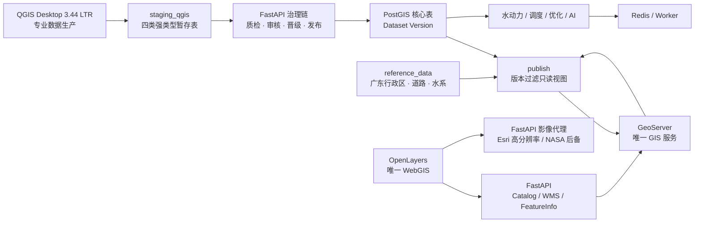

# 大禹·天工当前架构

更新日期：2026-08-18
架构基线：GIS-RESET-01

## 1. 总体结构



PostGIS 是唯一空间事实源。`imports`、`staging_qgis`、`reference_data`、`public` 核心表、`publish`、治理表和 TimescaleDB 时序表均在同一数据库内按 schema 和角色隔离，不创建第二套 GIS 数据库。

## 2. 权威边界

| 边界 | 当前职责 | 明确禁止 |
|---|---|---|
| QGIS Desktop | 暂存编辑、拓扑、表单、专业质检辅助 | 直写核心表、保存凭据、Web 发布 |
| FastAPI 治理链 | 批次、校验哈希、审核、晋级、发布、退役 | 绕过状态机写已冻结版本 |
| PostGIS Catalog | 9 个活动 GeoServer 图层和 3 个影像底图的唯一目录 | 浏览器自带业务图层清单 |
| GeoServer | `publish` WMS/WMTS/Basic WFS/GetFeatureInfo | WFS-T、读取 staging、核心 DML |
| FastAPI GIS 网关 | 版本门禁、layer allow-list、BBOX/尺寸/类型限制 | 接收任意 GeoServer 层名、SQL/CQL |
| OpenLayers | EPSG:3857 浏览、图层开关/透明度/顺序、点选 | 数据编辑、业务样式权威、直接访问数据库 |

## 3. 数据生产与发布

```text
原始资料 / QGIS
  → imports 或 staging_qgis
  → 内容哈希与规则质检
  → 人工提交审核
  → approve / reject / request_changes
  → 单事务晋级 Dataset Version
  → publish
  → GeoServer 读取 publish 视图
  → OpenLayers 按 dataset_version_id 浏览
```

状态分为批次状态和数据版本状态。已发布版本可进入 `retired`，但历史版本重新发布和一键回滚仍是后续能力。QGIS 在审核阶段之后由数据库触发器/RLS 和晋级时哈希复核共同阻止内容漂移。

## 4. 坐标系

- 权威数据、QGIS 工程和 PostGIS 几何：CGCS2000 `EPSG:4490`。
- Web 地图、WMS 视图和 OpenLayers：Web Mercator `EPSG:3857`。
- 度量分析必须使用经批准的 CGCS2000 投影坐标系，不用经纬度差代替米。
- 浏览器不改写权威几何；GeoServer 负责发布投影转换。

## 5. 在线 GIS 运行时

核心 Compose 服务只有：

- `database`
- `redis`
- `migrate` / `seed`
- `qgis-bootstrap` / `app-bootstrap`
- `geoserver` / `geoserver-init`
- `gis-catalog-seed`
- `backend` / `worker`
- `frontend`（Nginx + OpenLayers 构建产物）

QGIS Server、Martin、TiTiler、GeoNode 和 Cesium 已退出核心编排。旧迁移数据行仅以 inactive 形式保留用于可逆回退，不参与当前 Catalog 或浏览器运行路径。

## 6. Catalog 与 WebGIS

`gis_layer_registry` 沿用历史物理表名以避免复制数据，ORM 与运行概念已经改为 `GISCatalogLayer`。迁移 `20260817_0016` 激活 6 个版本化水利业务层和 3 个广东开放参考层，并强制所有 active 行满足：

- `source_schema = 'publish'`
- `service_mode = 'GEOSERVER_WMS'`
- `render_mode = 'RASTER_WMS'`
- 版本化业务层 `dataset_filter_field = 'dataset_version_id'`
- 开放参考层 `dataset_filter_field IS NULL`

前端先读取 `/api/v1/gis/catalog`，再为业务/参考图层创建同源 TileWMS，并为底图创建同源 XYZ。浏览器只提交 `dataset_version_id`、受控 `layer_key` 或预注册 `basemap_key`；FastAPI 再构造 GeoServer 图层名、版本过滤或固定的 Esri/NASA 白名单请求。Esri World Imagery 默认可见并允许至 z20，NASA 两层默认关闭。点选属性同样通过 `/api/v1/gis/feature-info`，不会直接拼接 GeoServer 查询。

图层管理与坐标定位由地图顶部的单开工具菜单控制，初始状态均为收起；再次点击当前按钮会关闭面板，点击另一按钮会切换面板。两个工具保持挂载，只改变可见性，因此收起不会重置图层表现状态、坐标输入或定位结果。坐标定位属于纯客户端地图交互：经纬度模式先按 -180～180/-90～90 校验，再由 OpenLayers 将 EPSG:4326 十进制度转换到 Web 视图；Web XY 模式明确接收 EPSG:3857 米制坐标，并按 Web Mercator 有效范围 ±20,037,508.343 米校验；CGCS2000 模式按 `X=东坐标`、`Y=北坐标` 接收三度带高斯-克吕格坐标，并通过 proj4 按用户选择的 111°E（EPSG:4546）、114°E（EPSG:4547）或 117°E（EPSG:4548）中央经线转换。三种模式最终都在 EPSG:3857 视图平滑定位并在最高层添加一个临时点，同时回显转换后的经纬度。该点不进入 Catalog、数据库或 GeoServer，清除时也不会改变业务图层状态。

广东参考层采用双名称口径：来源 `name` 原样保存用于审计，`name_zh` 是地图和属性弹窗的中文展示字段。行政区使用审核映射，道路/水系只发布含中文的已确认名称或规范化路线编号；无法确认的外文名和未命名占位符不渲染。GeoServer 使用包含 Noto Sans CJK SC 的定制镜像，SLD 不依赖宿主机字体。

## 7. 数据库角色

| 角色 | 类型 | 权限摘要 |
|---|---|---|
| owner | LOGIN | 迁移和初始化，不用于 API 常驻运行 |
| `dayu_backend` | LOGIN | API/Worker 非 owner 运行账号，继承发布组 |
| `dayu_publisher` | NOLOGIN | 受控晋级/发布组角色 |
| `dayu_geoserver` | LOGIN | 只读 `publish` 图层 |
| `dayu_qgis_editor` | LOGIN | 列级写四张暂存表，读参考/发布层 |
| `dayu_qgis_reviewer` | LOGIN | 暂存、问题、核心和发布层只读 |

统一 IAM 仍未完成；本地 actor/reviewer 字段用于开发审计，不等同生产身份认证。

## 8. 模型与动态状态

Dataset Version 仍是 GIS、模型、调度和 AI 的共同版本身份。静态权威对象冻结后不可原地修改；动态 `feature_state` 是时序事实追加，不改写静态设计参数。

GIS 晋级只保证空间核心数据的治理与发布，不伪造模型参数、边界条件或率定状态。模型任务只能选择满足其独立完整性条件的版本。

## 9. 当前限制

- 现有 9 个活动 GeoServer 图层均来自 `publish`，WFS 为 Basic read-only；未导入真实数据的旧参考层保持 inactive。
- 本阶段没有 Web 编辑、WFS-T、QGIS Server或三维运行时；广东高分辨率影像只通过 Esri 在线瓦片代理加载，NASA 为后备，不在本地复制或离线导出全省影像库。
- 生产 TLS、密钥托管、统一 IAM、灾备/高可用尚未完成。
- PLC/SCADA 未接入，仿真和调度输出不得直接下发真实设备。
