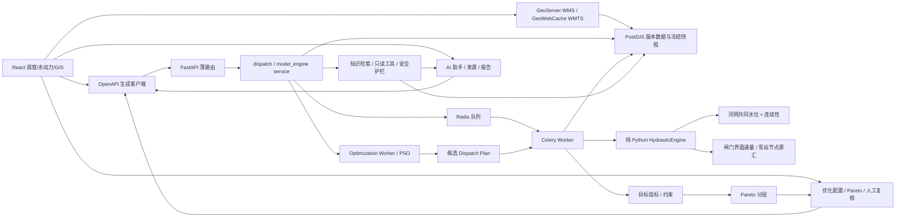

# 大禹·天工 Phase 1A / Phase 6 系统架构

## 总体链路

## 边界与所有权

| 层 | 责任 |
|---|---|
| `model/` | 框架无关的几何、边界、网格、求解、闸泵、控制、指标与 v1/v2 契约 |
| `backend/app/model_engine` | 创建时冻结模型输入、任务查询、结果持久化 |
| `backend/app/dispatch` | 计划/动作/规则版本、校验、冻结、对比和审计 |
| `backend/app/worker` | 原子认领、心跳、协作取消、重试、僵尸恢复 |
| `frontend/src/api/generated` | 前后端唯一接口边界 |
| `frontend/src/pages/dispatch` | 计划、运行、对比、结构/节点/事件 UI |
| `optimization/` | PSO、目标函数、约束与 Pareto 的框架无关核心 |
| `backend/app/optimization` | 冻结优化输入、候选仿真编排、持久化与推荐查询 |
| `frontend/src/pages/optimization` | 配置、任务监控、Pareto 与人工复核 UI |
| `ai/` | 助手生成、RAG、知识、工具、提示、报告与安全护栏 |
| `backend/app/ai` | AI 对话、来源、知识入库、只读工具、工具审计和报告 |
| `frontend/src/pages/ai` | 对话、来源、知识、报告和工具审计 UI |
| `geoserver/` | 幂等空间服务引导、SLD、只读连接、Basic WFS 与 WMTS 缓存 |
| `backend/app/geoserver` | WMS/WMTS 能力探测、图层清单和浏览器安全地址；不代理管理员 REST |
| `frontend/src/components/gis` | 小比例尺 WMTS、中比例尺 WMS、GetFeatureInfo 后通过 FastAPI 查询业务详情 |

路由不重复业务逻辑；引擎不读取数据库；模拟控制状态不写回静态 `gate.status`/`pump.status`。

优化层不修改水动力模型。每个有效候选生成独立 Phase 4 `simulation_task`，只有水动力任务成功并通过后置约束后才能进入有效 Pareto 前沿。推荐状态不等于执行授权。

AI 层只读取权威模型、优化和空间结果；工具固定为白名单，输入/输出均受门禁。回答和报告不具有设备执行权限。

## 输入、结果与一致性

任务创建时生成规范 JSON，记录 `input_schema_version`、SHA-256、`engine_version` 与 `engine_commit`。正式计算只读取 `simulation_case_boundary` 明确关联边界。v2 结果包含 section/node/structure/event/water_balance/metrics/diagnostics/provenance；v1 读取继续保留。

河网所有分支使用同步输出、动作和规则时刻。节点连续性在实际边通量应用后计算；闸门披露请求通量与受可用流量约束后的实际通量；泵站内部转输不计入外部收支，外排/外引明确计入全局水量平衡。

## GIS 双通道

PostGIS 是唯一 GIS 数据源。GeoServer 使用只读账号发布 `river`、`river_segment`、`river_node`、`cross_section`、`gate`、`pump`，样式均由工作区 SLD 管理；React 不再保存静态业务图层的颜色/符号。小比例尺优先使用 GeoWebCache/WMTS，中比例尺切换 WMS 并支持 GetFeatureInfo；选中稳定业务主键后，FastAPI `/api/v1/gis/*` 返回属性详情和模型联动数据。

WFS 服务级别固定为 `BASIC`，不暴露 Transaction 或 LockFeature。前端 Nginx 只代理公开 OGC 服务并拒绝 `/rest`、`/web`、`/gwc/rest`；GeoServer 管理账号只在内部初始化容器使用。

## 部署与装载

Compose 运行 PostGIS、Redis、GeoServer、migrate、seed、geoserver-init、backend、worker、frontend。GeoServer 数据目录使用独立持久卷，但只保存 catalog、SLD 引用与瓦片缓存，不保存第二套业务数据。Cesium 仅 GIS 路由下载；调度和水动力页面也按路由懒加载。当前主要大块仍是 Cesium、ECharts、Ant Design。
