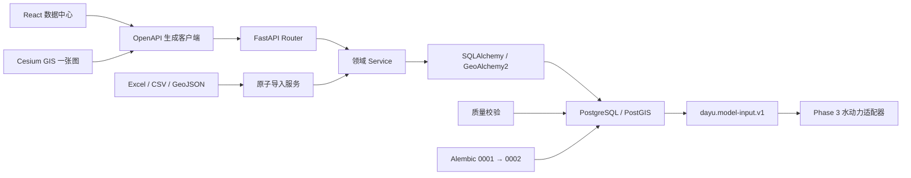
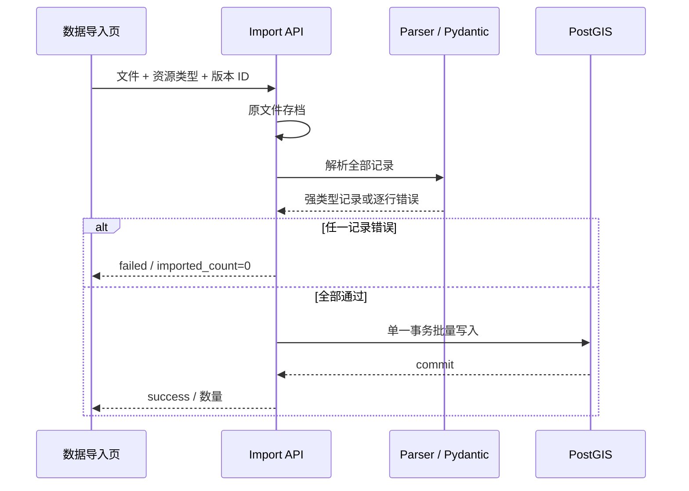

# 大禹·天工 Phase 2 系统架构

Phase 2 在 Phase 1 GIS 空间链路上增加版本化水利数据库、拓扑、批量导入、质量门禁和模型输入快照。当前闭环为“文件/编辑器 → 强类型 API → 版本化 PostGIS → 自动校验 → Phase 3 输入”，不执行水动力求解。

## 总体链路

`frontend/src/api/generated/client.ts` 仍是前端请求唯一入口；它由运行中后端 OpenAPI 生成。页面不自行调用 `fetch`，后端 Router 只处理 HTTP 输入/输出，事务和业务规则由 Service 所有。

## 后端模块

| 模块 | 职责 |
|---|---|
| `gis` | Phase 1 只读 GeoJSON、bbox、统计、PostGIS 健康；保留兼容属性 |
| `river` | 河道 CRUD、端点/交汇点识别、节点/河段/连接幂等生成 |
| `cross_section` | 断面 CRUD、剖面点顺序和粗糙率校验 |
| `structure` | 闸门、泵站静态设计参数 CRUD |
| `dataset` | 数据版本、参数、边界、计算方案和模型输入快照 |
| `import_service` | 原文件存档、Excel/CSV/GeoJSON 解析、全批校验、原子提交 |
| `validation` | 空间、水力、建筑物、拓扑、模型配置质量门禁 |

## 版本与模型语义

- 河道、节点、河段、连接、断面、闸门、泵站、参数和边界条件都绑定 `dataset_version_id`。
- 跨版本编码可复用，同一版本内由数据库唯一约束防重。
- 拓扑生成按容差合并河道折点；共享折点标记为 `confluence`，相邻节点形成有向计算河段和连接。
- `simulation_case` 引用数据版本与同版本边界条件。
- `/api/v1/model-data/simulation-cases/{id}/input` 是只读快照，不写入水位、流量、流速等计算结果。

## 导入事务

## 前端装载边界

- 首页、GIS、数据中心均为路由动态导入。
- Cesium 保持独立懒加载块，只在首页或 `/gis` 进入时请求。
- 数据中心页面共享一个业务块；断面图表按需动态加载 ECharts。
- `/rivers` 保留兼容跳转，正式入口为 `/data-center/rivers`。

## 部署顺序

Docker Compose 严格串联：`database healthy → migrate completed → seed completed → backend healthy → frontend`。默认宿主端口为后端 `8001`、前端 `8080`，避免占用工作区既有的 `8000` 服务。

## 阶段边界

实时遥测、模型数值求解、调度执行、优化算法和 AI 决策仍不属于 Phase 2。`model/`、`optimization/`、`ai/` 保持适配器边界，Phase 3 只消费已校验的版本化输入快照。
