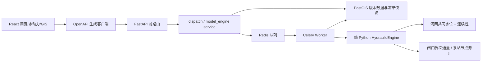

# 大禹·天工 Phase 4 系统架构

## 总体链路

## 边界与所有权

| 层 | 责任 |
|---|---|
| `model/` | 框架无关的几何、边界、网格、求解、闸泵、控制、指标与 v1/v2 契约 |
| `backend/app/model_engine` | 创建时冻结模型输入、任务查询、结果持久化 |
| `backend/app/dispatch` | 计划/动作/规则版本、校验、冻结、对比和审计 |
| `backend/app/worker` | 原子认领、心跳、协作取消、重试、僵尸恢复 |
| `frontend/src/api/generated` | 前后端唯一接口边界 |
| `frontend/src/pages/dispatch` | 计划、运行、对比、结构/节点/事件 UI |

路由不重复业务逻辑；引擎不读取数据库；模拟控制状态不写回静态 `gate.status`/`pump.status`。

## 输入、结果与一致性

任务创建时生成规范 JSON，记录 `input_schema_version`、SHA-256、`engine_version` 与 `engine_commit`。正式计算只读取 `simulation_case_boundary` 明确关联边界。v2 结果包含 section/node/structure/event/water_balance/metrics/diagnostics/provenance；v1 读取继续保留。

河网所有分支使用同步输出、动作和规则时刻。节点连续性在实际边通量应用后计算；闸门披露请求通量与受可用流量约束后的实际通量；泵站内部转输不计入外部收支，外排/外引明确计入全局水量平衡。

## 部署与装载

Compose 运行 PostGIS、Redis、migrate、seed、backend、worker、frontend。Cesium 仅 GIS 路由下载；调度和水动力页面也按路由懒加载。当前主要大块为 Cesium 4.19 MB、ECharts 1.14 MB、Ant Design 1.11 MB（均为构建时未压缩值）。
