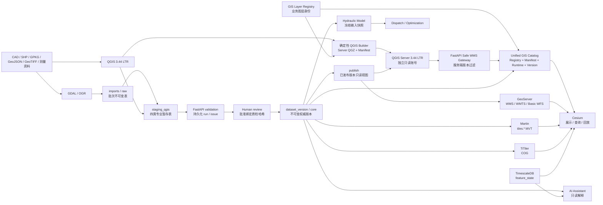

# 大禹·天工当前系统架构

本文只描述仓库当前实现。未来扩展进入工作计划或阶段建议，不与当前能力混写。

## 总体链路



`dayu_tiangong` PostGIS 是唯一业务空间事实源。`imports`、`staging_qgis`、核心 `public` 表、`publish` 和 `tiles` 都在同一业务数据库内按 schema/权限分工，不建立第二套 GIS 数据库。可选 GeoNode profile 使用同一 PostgreSQL 服务和隔离的目录/资产边界，不成为权威业务空间库，也不参与 GIS-OPT-1 的必要运行路径。

## 职责与所有权

| 层 | 当前责任 |
|---|---|
| QGIS 3.44 LTR | 专业桌面生产；加载参考层、四类暂存编辑层和发布审阅层；不拥有审批或晋级权 |
| GDAL/OGR | 文件检查、格式/坐标转换、不可变原始落地区；不把 `imports` 直接变为权威数据 |
| `backend/app/gis_governance` | 批次状态、质检、问题、审核、差异、原子晋级、内容哈希和发布清单 |
| `backend/app/api` | 薄路由、输入输出和事务错误映射；业务状态转换在 service 层 |
| PostGIS | 约束、空间检查、版本化核心对象、发布视图与权限隔离 |
| `model/` | 框架无关的几何、边界、网格、求解、闸泵、控制、指标与 v1/v2 契约 |
| `backend/app/model_engine` | 创建时冻结模型输入、任务查询、结果持久化；历史快照继续绑定原 `dataset_version_id` |
| `backend/app/dispatch` | 计划、动作、规则、冻结、对比和审计 |
| `backend/app/worker` | 原子认领、心跳、协作取消、重试与僵尸恢复 |
| `optimization/` / `backend/app/optimization` | PSO、多目标、候选仿真、约束、Pareto 和人工推荐，不修改模型权威数据 |
| `ai/` / `backend/app/ai` | 来源约束生成、RAG、知识、只读工具、安全护栏、报告和审计 |
| `frontend/src/api/generated` | 前后端唯一接口边界 |
| `qgis/server` | 从 Desktop 主工程和 Registry snapshot 确定性生成只读 Server QGZ 与 canonical manifest |
| `backend/app/qgis_server` | 限定 WMS 操作和浏览器参数，服务端合成版本过滤，分项报告运行证据 |
| `backend/app/gis_catalog` | 合并 Registry、QGIS manifest、服务健康和 Dataset Version，只返回 browser-safe DTO |
| `frontend/src/gis` | 仅按 `service_mode + render_mode` 选择 QGIS WMS、legacy WMS/WMTS、Martin、TiTiler、dynamic 或 3D adapter |
| QGIS Bridge | 只调用 FastAPI 治理路由，显示 validation/review/publish 并以临时 memory layer 定位 issue |
| `geoserver/` | 只读 PostGIS 连接、SLD、WMS、WMTS、Basic WFS；不提供 WFS-T 写入口 |
| Martin | 调用 `tiles.*` 版本过滤函数发布 MVT，不替换 GeoServer |
| TiTiler | 只读提供登记过的 COG 元数据与瓦片，不自研栅格服务器 |
| Cesium | Web 二三维展示、查询、版本切换、时间回放和模型结果，不承担桌面 GIS 编辑 |
| TimescaleDB | `feature_state` 追加式时态状态，不回写闸泵静态设计字段 |

## QGIS 受控生产面

QGIS 工程基准为 EPSG:4490，数据源只引用 `service='dayu_qgis'`，不嵌入主机密码、个人绝对路径或 token。工程分组固定为：

- `01_REFERENCE_READONLY`：已发布/核心参考河道、节点、河段及基础地图对象；
- `02_EDIT_STAGING`：`staging_qgis.river`、`cross_section`、`gate`、`pump`；
- `03_PUBLISH_READONLY`：`publish.river`、`cross_section`、`gate`、`pump`。

编辑者的数据库权限只允许四张暂存表 DML 和必要参考/治理读取；审阅者设置 `default_transaction_read_only=on`；`dayu_publisher` 是 `NOLOGIN` 发布组，非 owner 的 `dayu_backend` 已成为其成员并承载 backend/worker。迁移、seed 和权限引导仍由独立的一次性 owner 任务执行。

## 数据治理状态

批次、一次质检、一次审核和权威版本是四种独立状态：

```text
created → staged → validating → validation_failed | validated
validated → in_review → changes_requested | rejected | approved
approved → promoting → promoted → published → retired
```

- `gis_import_batch.status` 表示批次处理阶段；
- `gis_validation_run.status` 只表示一次规则执行结果，问题写入 `gis_validation_issue`；
- `gis_review.decision` 是绑定 `validation_run_id` 和暂存内容哈希的追加式人工决定；
- `dataset_version.status` 表示权威版本生命周期，晋级和发布不是同一个动作。

校验后如果暂存业务内容变化，哈希会失效，必须重新质检和提交审核。晋级锁定批次，在一个数据库事务内克隆父版本、应用 `upsert/delete`、重建河网拓扑、计算与自然行顺序和自增 ID 无关的 SHA-256，并创建唯一 `source_batch_id` 的新版本；失败时事务整体回滚，重复请求返回同一版本。

## 发布通道与兼容边界

`publish.*` 视图只选择 `dataset_version.status='published'` 的权威对象，并保留稳定 `id`、`dataset_version_id`、版本号和内容哈希。0012 将河道/拓扑/断面/闸泵/注记/基础地图对象补齐为 12 个 GeoServer 兼容视图；GeoServer、QGIS reviewer 和发布角色只读这些视图。

GeoServer 的 `dayu_postgis` store 已切换到 `publish`，数据库账号已撤销 `public` 核心表读取；12 层仍按 `dataset_version_id` 提供 WMS/WMTS/Basic WFS/GetFeatureInfo 与 Cesium 兼容行为。Martin 继续读取 `tiles.*`，TiTiler 继续读取登记的 COG，二者均未被替换。

GIS-OPT-2 新增的 QGIS Server 只发布 `river/cross_section/gate/pump`，使用不具备核心/暂存读取权的 `dayu_qgis_server`。容器不映射宿主端口，浏览器只能通过 `/qgis-server/wms` 访问 FastAPI；Gateway 拒绝 `MAP/FILTER/SQL/CQL/datasource/URL` 和未知 vendor 参数，并从受控 Registry 解析 short name 和 `dataset_version_id`。GetPrint 在真实双版本图像/FeatureInfo 隔离与打印内容检查通过前保持禁用。

`gis_layer_registry` 是图层稳定身份与服务/渲染方式的权威源；`basemap_registry` 仅存 deployment-owned endpoint key。Catalog 不返回 schema/relation/internal URL/DSN/project path，并在 manifest 漂移或服务不健康时缩减能力。旧 `/api/v1/gis-analysis/layers` 和 `/api/v1/dgis/catalog` 保留兼容，不再驱动主地图业务图层树。

## 横断面加法空间模型

0014 保留 `cross_section.geometry=Point`、`points` JSON、`station` 和原主键，另行新增 `cross_section_location`、`cross_section_axis`、`cross_section_point`、`cross_section_profile`。新表与旧断面通过 `(cross_section_id,dataset_version_id)` 复合外键绑定，因此不能跨版本挂载空间或高程数据。旧水动力 solver 输入完全不变；新 GIS 消费者通过 `publish.cross_section_spatial` 逐步接入。

## 模型、调度、优化与 AI 一致性

模型任务创建时冻结规范 JSON、输入 SHA-256、引擎版本与提交来源。治理晋级只创建新 GIS 权威版本，不重写旧版本，不移动历史模型快照，也不伪造新版本的边界条件或率定状态。

优化候选继续产生独立仿真任务；只有成功并满足后置约束的候选进入 Pareto 前沿，推荐不等于执行授权。AI 只读取权威模型、优化和空间结果，固定使用只读工具，回答与报告没有设备执行权限。

## 身份与运行边界

数据库角色已形成 editor/reviewer/publisher/backend/GeoServer/Martin 的授权边界，backend/worker 已脱离 owner。请求合同保留 actor 字段，批次 operator、reviewer、creator、published_by 等信息会进入治理记录；但平台统一 OIDC/OAuth2 身份和端点级 RBAC 尚未完成，因此 mutation API 仍只能作为受控开发/验收控制面，不能据此宣称生产身份安全闭环。

系统数据仍为 DEMO，水动力模型未经真实工程率定，不连接实时 PLC/SCADA，也不具备自动控制设备权限。QGIS 生产链完成不等于生产级数字孪生完成。
