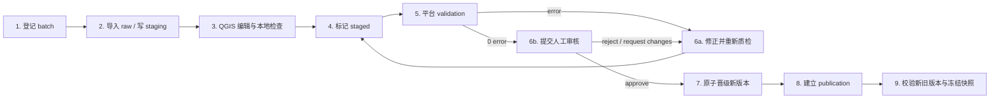

# QGIS 受控数据生产流程

## 适用范围

本文适用于 QGIS 3.44 LTR 对河道、横断面、闸门和泵站数据的生产与审阅。QGIS 是专业编辑工具，不是大禹·天工平台、审批系统或发布服务器；它只写 `staging_qgis`，不能直接修改生产核心表。

## 准备连接

1. 由管理员完成 Alembic `20260814_0012`、`database/bootstrap_qgis.py` 和 `database/bootstrap_app.py`。
2. 从 `qgis/docs/pg_service.conf.example` 复制 `[dayu_qgis]` 到用户自己的 PostgreSQL service 文件。
3. 通过 `PGSERVICEFILE` 指向该文件；密码放在 QGIS Authentication Manager、操作系统凭据设施或本机受控凭据文件，不写入仓库。
4. 编辑者使用 `dayu_qgis_editor`；审阅者使用 `dayu_qgis_reviewer`。不要给桌面用户 `dayu_publisher` 或数据库 owner。
5. 用 QGIS 3.44 LTR 打开 `qgis/projects/dayu_tiangong_ltr.qgs`，确认工程 CRS 为 EPSG:4490。

工程包含三个固定分组：

- `01_REFERENCE_READONLY`：参考河道、节点、河段、行政区、道路和地名；
- `02_EDIT_STAGING`：四类暂存编辑层；
- `03_PUBLISH_READONLY`：四类已发布版本审阅层。

## 标准流程



### 1. 登记来源批次

通过 `POST /api/v1/gis-governance/batches` 登记：对象类型、原文件名、格式、大小、来源 SHA-256、源 CRS、目标 CRS、字段映射版本、操作人、测量时间和可选父版本。一个批次只处理一种 `entity_type`。

GDAL PostGIS 导入接口也会自动登记批次，并把数据写入服务器生成的 `imports.batch_<job>_<label>` 表。请显式传入 `entity_type` 和 `operator`；仅当 `layer_name` 是 `river(s)`、`cross_section(s)`、`gate(s)` 或 `pump(s)` 这些旧别名时，接口才会为兼容旧调用推断对象类型，其他逻辑标签不会被默认伪装为河道。如果传入 `parent_version_id`，父版本必须已批准、已发布或已退役，且已生成 `content_hash`。

`imports` 是不可变来源落地，不是权威数据。原始表落地成功后批次仍保持 `created`，`metadata_json._governance.raw_landing` 记录 `completed`，同时标记 `standardization=required`；GDAL 失败会记录 `failed/blocked` 及精简错误。只有后续受控流程将原始字段标准化到对应 `staging_qgis` 表并确认完成后，才能调用 stage；不得把 raw landing 成功等同于已暂存。

raw 批次调用 stage 时，请在请求体中同时提交操作人并显式设置 `standardization_completed=true`。平台会确认原始表仍存在且对应强类型暂存表至少有一条映射记录，再把标准化完成时间和操作人写入批次元数据；直接登记并由 QGIS 写入暂存的批次不需要此标记。

### 2. 选择并编辑暂存层

在 `02_EDIT_STAGING` 中只编辑与批次对象类型一致的图层。每条记录必须填写 `batch_id`、`source_feature_id`、来源 CRS/哈希/操作人以及该对象的业务字段。批次增量通过：

- `operation=upsert`：新增或按业务编码更新；
- `operation=delete`：晋级时从新版本删除该业务编码，旧版本保持不变。

QGIS 表单会隐藏或锁定系统字段，并提供必填、值域、捕捉和拓扑提示。数据库 CHECK/UNIQUE 与平台质检才是最终规则，不得把 QGIS 表单通过等同于可晋级。

### 3. 编辑检查

- 河道端点、顶点和线段按工程捕捉设置编辑，检查空几何、自交、重复节点和零长度；
- 横断面、闸门、泵站点位应落在目标河道的合理位置，并填写父版本中存在的 `river_code`；
- EPSG:4490 是经纬度坐标，不在其中直接进行米制长度、面积或缓冲；
- 保存前核对 `batch_id`，不得把不同对象类型或不同来源批次混写。

### 4. 质检与修正

依次调用：

```text
POST /api/v1/gis-governance/batches/{id}/stage
POST /api/v1/gis-governance/batches/{id}/validate
GET  /api/v1/gis-governance/batches/{id}/validation
GET  /api/v1/gis-governance/batches/{id}/issues
```

平台把规则版本、暂存内容哈希、开始/结束时间、汇总和每个 issue 持久化。任何 `error` 都阻断审核/晋级；warning 需要人工判断并在审核意见中说明。`request_changes` 进入可返工的 `changes_requested`，修正后重新 stage/validate；`reject` 进入终态，不能借由普通 stage 请求重新打开。旧质检只作为历史证据，不能复用旧批准。

### 5. 审核、差异和晋级

审阅者使用只读账号检查参考、暂存、问题与 `publish` 视图，并通过平台控制面完成：

```text
GET  /api/v1/gis-governance/batches/{id}/diff
POST /api/v1/gis-governance/batches/{id}/submit-review
POST /api/v1/gis-governance/batches/{id}/review
POST /api/v1/gis-governance/batches/{id}/promote
```

批准必须绑定最新通过的质检运行与同一暂存内容哈希。晋级在单事务中创建新 `dataset_version`，不会覆盖父版本；重复晋级同一成功批次只返回同一权威版本。失败后应查询状态和日志，不能手工把半成品写入核心表。

### 6. 发布和验收

调用 `POST /api/v1/gis-governance/versions/{version_id}/publish` 写入发布者和服务清单。`publish.*` 随版本状态只读暴露已发布数据。

GeoServer 12 层已经切换到 `publish.*`。每次发布验收仍应明确验证：新旧 `dataset_version_id` 均可读取、GeoServer 保持 Basic WFS 且无 Transaction/LockFeature、Martin/TiTiler/Cesium 行为未退化、旧模型快照仍引用旧版本。

## 人工 DEMO 验收

1. 用 DEMO 河道文件创建 river batch 并记录来源 SHA-256/CRS。
2. 导入 raw，标准化进入 `staging_qgis.river`。
3. QGIS 打开编辑层，修改一个允许的字段或几何并保存。
4. 运行平台质检，确认 0 error；若有 error，修正并产生新的 validation run。
5. reviewer 检查 diff/issues 后 approve。
6. promote，确认只创建一个新版本并生成 `content_hash`。
7. publish，确认 `publish.river` 可见新版本。
8. 确认旧版本仍可读，历史 simulation snapshot 的 `dataset_version_id` 未变化。

Windows 项目环境可双击 `qgis/Start_Dayu_QGIS.cmd` 打开经过验收的 QGIS 3.44.13 工程；启动器仅从被忽略的 `.env` 读取 editor 口令。没有 QGIS GUI 的自动化环境可用 SQL fixture 模拟第 3 步，但这不替代桌面人工验收。所有数据仍是 DEMO，模型未经真实工程率定，流程不连接 PLC/SCADA，也没有设备执行权限。
