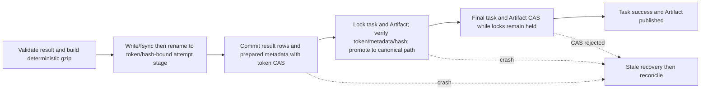

# HYDRO-MODEL-02-D2-RC1 Result and Artifact Reconciliation

## Purpose and boundary

This is the current recovery contract for native-v4 relational result rows and the
local `dayu.hydraulic-stage-evidence.v1` file. It is bounded reconciliation, not a
distributed transaction, automatic scientific replay, or a claim that RC1 fault gates
have passed.

## Prepared, rename, and final CAS



Before the first commit, the implementation replaces this task's Section, Gate, Pump,
Control Event, and Artifact rows, inserts one `prepared` Artifact row, and stores
prepared diagnostics plus a token-hash/content-hash-derived staging identity. The task
update requires `running`, no cancellation, and the active execution token. The
temporary file is fsynced and renamed only to that attempt-scoped staging path; the
canonical download path remains untouched.

The final transaction locks the task and Artifact rows, rechecks lease, metadata,
size, and SHA-256, and only then performs an atomic replace to:

```text
hydraulic-evidence/task-{task_id}-stage-evidence-v1.jsonl.gz
```

While those locks remain held, the transaction CAS-updates the task to
`success`/`published`, and CAS-updates Artifact metadata from `prepared` or
`publishing` to `published`. Either both database updates commit or neither does.
Normal result reads and downloads require both task success and published metadata.

## Reconciliation Cases A-F

| Case | Database and file observation | Report outcome | Explicit apply behavior |
|---|---|---|---|
| Case A | No Artifact metadata; no final file | `clean_no_artifact` | Normalize a failed/cancelled task to Artifact `none`; otherwise no mutation |
| Case B | Metadata `prepared`; no temporary or final file | `prepared_artifact_missing` | Mark Artifact row and task Artifact state `failed`; retain task failure for reviewed retry |
| Case C | Prepared metadata; final file exists; byte size and SHA-256 match | `publishable_prepared_artifact` only if prepared scientific rows/diagnostics are complete | Mark task `success`, Artifact `published`, and record reconciliation action/time |
| Case D | Prepared metadata; final file exists; byte size or SHA-256 differs | `artifact_integrity_mismatch` | Move the corrupt file to quarantine and mark Artifact integrity failed; never promote |
| Case E | Task `success`, metadata `published`, final file missing | `published_artifact_missing` | Mark task/Artifact integrity state failed and set an operational error; result/download gates stop serving it |
| Case F | Final file exists; no Artifact metadata | `orphan_final_file` | Quarantine the orphan; a non-success task returns to `none`, while success records an integrity failure |

Additional fail-closed cases are part of the same command:

- an active token or `running/cancel_requested` returns
  `active_attempt_not_reconciled` without mutation;
- exact temporary siblings left without usable metadata are quarantined;
- an expired attempt staging file is deterministically quarantined and never promoted,
  even when its bytes match, because its token no longer owns the lease;
- a metadata storage key other than the deterministic task key is failed without
  inspecting the referenced path;
- a cancelled task's final file is quarantined;
- a valid file without a complete prepared scientific result is quarantined and the
  task is not promoted;
- an already published task whose file and metadata agree returns
  `published_artifact_consistent`.

## Operator interface and path safety

```text
# read-only JSON report
python -m app.model_engine.reconcile_v4_task --task-id 123

# perform only the reported bounded repair
python -m app.model_engine.reconcile_v4_task --task-id 123 --apply
```

Dry-run is the default. `--apply` is required for row locks, status changes, rename to
quarantine, or publication completion. The command handles one native-v4 task; it does
not recursively scan storage.

The storage root is the resolved `DAYU_STORAGE_ROOT` (or the configured local default).
All canonical, attempt-staging, and quarantine paths use root-contained resolution that rejects absolute
children and directory escape. Attempt staging is derived from trusted token/content
hash metadata; temporary discovery is limited to non-symlink siblings matching that
exact atomic-output prefix/suffix. Quarantine remains
under `hydraulic-evidence/quarantine` inside the same root.

## Stale recovery and retry gate

Stale recovery first fences the old execution token. For a finalization phase or
Artifact state it sets the task and any prepared/publishing Artifact row to
`reconciliation_required`. The reconciler then decides whether evidence is missing,
publishable, corrupt, cancelled, or orphaned.

Manual retry remains blocked while a v4 task has `prepared`, `publishing`, `published`,
`orphaned`, or `reconciliation_required` Artifact state. It becomes eligible only when
the task is terminal, no execution token is active, and reconciliation has produced a
clean null/`none`/`failed` Artifact state. Scientific failure is never auto-promoted.
