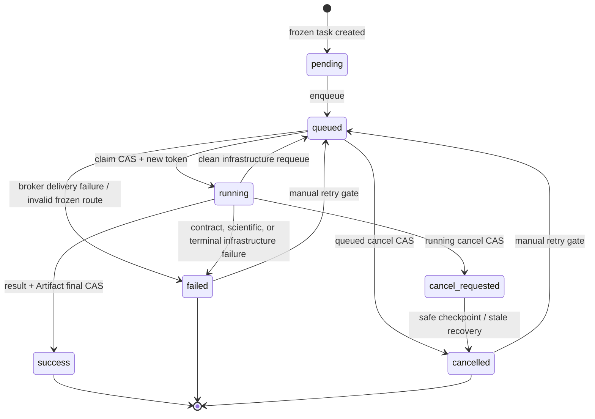

# HYDRO-MODEL-02-D2-RC1 Task State Machine

## Status authority

`simulation_task` is the authority for task state, execution attempts, cancellation,
and retry eligibility. Celery delivery is only a trigger. This document describes the
current RC1 candidate interfaces; it does not report a test or hosted release result.



`failed` and `cancelled` are terminal for one attempt, not necessarily for the frozen
task identity: an explicit eligible manual retry can return the same task to `queued`.
`success` is immutable; recomputation requires a new task.

## Attempt and token CAS

Claim is a single conditional database update. It requires `status=queued`; native v4
also requires the exact schema and all five Registry provenance fields (solver,
capability, runtime adapter, result schema, Registry hash). The winner:

- increments `execution_attempt_count`;
- sets `running`, Worker identity, start/heartbeat time, and initial phase;
- assigns a new 32-character UUID-hex `active_execution_token`.

A competing delivery for a running or terminal task fails claim and returns a normal
duplicate no-op. A still-queued v4 row with a mismatched/NULL route is instead
CAS-marked failed without creating an attempt, so it cannot be periodically
redelivered forever. Every
heartbeat is conditional on task ID, `running`, `cancel_requested=false`, and that
token. Terminal failure/cancellation and success also require the active token and an
allowed state. When an attempt ends or is requeued, the token is copied to
`last_execution_token` and cleared. A late Worker holding an older token cannot update
the newer attempt.

## Native-v4 execution phases

```text
validating_snapshot -> projecting_runtime -> solving -> serializing
-> persisting -> publishing_artifact -> finalizing
```

Heartbeat progress is monotonic and capped below 100 until a terminal transition.
Optional phase heartbeats do not clear the last accepted simulation time, CFL, event,
or numerical counters when those values are omitted.

## Three retry domains

| Domain | Counter and scope | State transition | Replay boundary |
|---|---|---|---|
| Numerical retry | `numerical_retry_count` plus CFL, positivity, event, Gate, Pump, and minimum-dt counters | No task-status transition | Solver retries a rejected trial inside the same execution token; rejected trials are not accepted progress |
| Infrastructure retry | `infrastructure_retry_count` | Clean `running -> queued`, then Celery redelivery | Connection/timeout/OS/DB-operational failures and stale non-finalization leases; database requeue happens before delivery; at most two requeues |
| Manual retry | `manual_retry_count` | Reviewed `failed/cancelled -> queued` CAS | Explicit API action; preserves the frozen snapshot and provenance, clears attempt telemetry, and receives a new token only on the next claim |

`retry_count` remains a legacy compatibility field. Native-v4 solver trials use
`numerical_retry_count`; native-v4 manual retry does not increment the legacy field.

An infrastructure error does not requeue when cancellation is pending, its bounded
retry allowance is exhausted, or the attempt has entered a result/Artifact
finalization window. A finalization error instead becomes `failed` with
`artifact_status=reconciliation_required`.

## Cancellation and final CAS

Cancellation uses status CAS rather than overwriting an ORM object unconditionally:

- `queued -> cancelled` is immediate and terminal;
- `running -> cancel_requested` sets the cooperative stop signal;
- solver, serialization, persistence, and publication checkpoints complete it as
  `cancelled` using the same execution token.

The success CAS requires `running`, the same token, and
`cancel_requested=false`. If success commits first, a later cancel request is rejected
and cannot change `success`. If cancellation commits first, heartbeat and success CAS
are rejected; the attempt closes as cancelled or becomes reconciliation work if the
file-publication boundary has already been crossed.

## Stale recovery and retry gate

Celery beat runs every 30 seconds. It first selects `running` or `cancel_requested`
rows whose heartbeat is older than the cutoff, then updates only when status, token,
retry count, and the observed heartbeat still match. It subsequently republishes old
`queued` rows only when `queue_job_id` is null. A successful delivery stores that
marker; an unavailable broker leaves it null. This prevents both a DB/broker publish
gap and repeated publication of a legitimately queued message.

- stale `solving` within the infrastructure retry budget becomes a clean `queued`
  attempt, clears the active token/delivery marker, increments the infrastructure
  counter, and resets attempt telemetry; an exhausted lease becomes `failed`;
- stale pending cancellation becomes `cancelled`;
- stale `persisting`, `publishing_artifact`, or `finalizing`, and finalization Artifact
  states, additionally become `reconciliation_required`;
- prepared/publishing Artifact rows for that task are marked
  `reconciliation_required` in the same recovery transaction.

Manual retry is eligible only for `failed` or `cancelled`, no active token, and for v4
an Artifact state of null, `none`, or `failed`. All prepared, publishing, published,
orphaned, and reconciliation-required states are blocked until the bounded reconciler
returns the task to a safe state. See
`HYDRO-MODEL-02-D2-RC1-result-artifact-reconciliation.md`.
