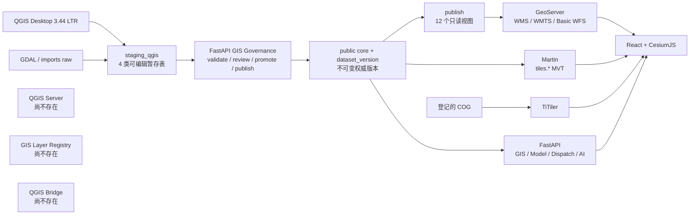

# GIS-OPT-2 Baseline Audit

- 审查日期：2026-08-15（Asia/Shanghai）
- 审查阶段：GIS-OPT-2 Step 1–2，仅仓库基线审查
- 远端仓库：`zj1310426307-stack/dayu-tiangong`
- 权威基线：远端 `main` / `88b5d7761acafbacda154674e8479a2ce6d5c3c8`
- 基线代码树：`32a8a594f926fa1e4adb69f972b4b181eeb208a8`
- 本地审查分支：`agent/gis-opt2-baseline-audit`
- 实施状态：**GIS-OPT-2 尚未开始实现**

## 1. 审查范围与证据边界

本报告严格执行任务书的首轮要求：审查仓库并形成基线，不新增 QGIS Server、数据库迁移、Registry、Catalog、QGIS 插件或前端功能。任务书后续章节在本轮仅作为审查维度和未来计划，不作为立即修改代码的授权。

远端 `main` 已通过 GitHub API确认指向 `88b5d77`。当前本地提交 `1fdd3d1` 是该合并提交的第二父节点，两者代码树 SHA 均为 `32a8a594…`，因此本报告审查的文件内容与远端 `main` 完全一致。由于当前 GitHub Git HTTPS 节点连接重置，本地引用未 fetch 到合并提交；这不改变代码树一致性或远端基线身份。

本轮读取并交叉核对：

- `README.md`、`docs/architecture.md`、现有 GIS/QGIS/数据库文档；
- `qgis/` 工程、样式、启动器、Processing 占位说明；
- `geoserver/` bootstrap、验证脚本、12 个 SLD；
- FastAPI GIS、GeoServer、DGIS、GIS Analysis、Governance、Dataset 与 Cross Section 模块；
- React/Cesium GIS 页面、图层管理、DGIS 组件、数据版本上下文、生成客户端；
- Alembic 迁移、角色 bootstrap、Compose、Nginx 与测试目录；
- 离线测试、QGIS CLI、前端类型/构建和 Compose 静态配置。

## 2. 执行结论

当前系统已经是一个具备单库事实源、QGIS 受控暂存、质检审核、不可变版本晋级、12 层只读发布和 Cesium 动态联动能力的 **GIS-OPT-1 受控生产底座**。这些能力应保留。

但它还不是 GIS-OPT-2 所要求的“QGIS 专业 GIS 工程主控端”：

1. QGIS Server 不存在于代码、Compose、代理和健康检查中。
2. Web 静态业务图层仍由 React 编译期数组驱动。
3. 后端、GeoServer bootstrap、QGIS Project 与 DGIS 各自维护部分图层清单。
4. 已有两个目录 API，但都不是 Registry + QGIS Project 驱动的统一业务 Catalog。
5. QGIS 工程不能驱动 Web 图层树，且当前工程不是可直接安全发布的 QGIS Server 工程。
6. QGIS Bridge 插件不存在，QGIS 无法在桌面内操作治理 API 或加载 issue 问题层。
7. 横断面核心和暂存几何仍为 Point；实测轴线、测点和高程基准没有独立空间模型。

结论：**可以进入 ADR 和契约设计阶段，但不能直接跳到容器接入或前端重构，更不能宣称 GIS-OPT-2 已实现。**

## 3. 当前 GIS 架构

### 3.1 当前职责事实

| 组件 | 当前事实 | GIS-OPT-2 适配判断 |
|---|---|---|
| PostGIS | 唯一业务空间事实源；`imports`、`staging_qgis`、核心、`publish`、`tiles` 同库分区 | 保留 |
| QGIS Desktop | 3.44 LTR；仅四类 staging 可编辑，reference/publish 只读 | 保留并扩展平台桥接 |
| QGIS Project | EPSG:4490、AutomaticGroups、3 个顶层职责组、14 个图层、3 个关系 | 需重构为专业目录并形成 Server 安全边界 |
| FastAPI Governance | 批次、质检、issue、审核、diff、晋级、发布、退役 API 已存在 | 直接复用；插件只能调用该边界 |
| GeoServer | 12 个 `publish` 图层、12 个 SLD、7 个 WMTS 缓存层、Basic WFS | 过渡期保留 |
| Martin | 读取 `tiles.*`，发布 5 类 MVT 源 | 保留 |
| TiTiler | 只服务登记的 `/data/` COG | 保留 |
| CesiumJS | 静态 WMS/WMTS、MVT、COG、3D、动态水动力和调度状态 | 保留，改为 Catalog 驱动 |
| QGIS Server | 无 Compose 服务、代理、后端健康端点或测试 | 尚未实现 |
| QGIS Bridge | `qgis/plugins/` 不存在 | 尚未实现 |
| 统一 IAM/RBAC | actor/reviewer/publisher 为审计字段，未由统一身份提供商验证 | GIS-OPT-2 控制面高风险边界 |

## 4. 任务书十项已知风险核查

| # | 核查项 | 当前结论 | 主要证据 |
|---|---|---|---|
| 1 | `CesiumMap.tsx` 是否硬编码图层、分组、缓存、默认显示和底图 | **是** | `WORLD_IMAGERY_URL`、`CACHED_LAYERS`、`staticLayerKeys`、`dynamicLayerKeys`、`layerLabels`、`layerGroups`、统一 `visible=true/opacity=0.88` 均在组件内 |
| 2 | FastAPI GeoServer 是否维护另一套图层列表 | **是** | `backend/app/geoserver/service.py::EXPECTED_LAYERS` 固定 12 层及标题、类型、样式、缓存 |
| 3 | GeoServer bootstrap 是否再次维护图层配置 | **是** | `BASEMAP_LAYERS`、`LAYER_TITLES`、`CACHED_LAYERS` 独立存在 |
| 4 | QML 与 SLD 是否独立维护 | **是** | QGIS 8 个 QML，GeoServer 12 个 SLD；`qgis/README.md` 明确二者不自动同步 |
| 5 | QGIS 图层树是否能驱动 Web | **不能** | Web 不读取 QGIS Project；`LayerManager` 和 `CesiumMap` 使用编译期结构 |
| 6 | `qgis/processing/` 是否已有平台集成工具 | **没有** | 目录只有 README，说明优先原生 Processing，未提供模型或 API 工具 |
| 7 | QGIS Bridge 是否存在 | **不存在** | `qgis/plugins/` 不存在 |
| 8 | QGIS 是否可在桌面内完成治理闭环 | **不能** | Governance API 完整，但没有 PyQGIS 客户端、面板、issue layer 或 deep-link 操作入口 |
| 9 | Web 新增图层是否必须修改 React | **是** | 至少要修改类型联合、key 数组、标签、分组、初始化设置和渲染/选择适配代码 |
| 10 | 横断面是否仍以 Point 为主 | **是** | 核心与 staging `cross_section.geometry` 均为 Point，剖面测点保存在 JSON `points` 中 |

## 5. 重复配置点

### 5.1 图层清单与业务语义

| 配置源 | 当前数量/范围 | 问题 |
|---|---:|---|
| `CesiumMap.tsx` | 11 个静态 key + 5 个动态 key；注记另由 FastAPI 图层处理 | Web 编译期权威源 |
| `LayerManager.tsx` | 4 个固定分组及中文标题 | 新组必须改代码 |
| `gis_analysis.service.layer_catalog()` | 22 个静态/动态/分析目录项 | 后端硬编码；生成客户端存在，但主 GIS 页面不调用 |
| `dgis.service.VECTOR_TILE_SOURCES` | 5 个 MVT source；另含 simulation layers | 只描述基础设施和资产，不是业务图层目录 |
| `geoserver.service.EXPECTED_LAYERS` | 12 层 | 健康和前端配置契约独立维护 |
| `geoserver/bootstrap.py` | 12 层标题、5 层底图组、7 层缓存 | 发布与缓存再次独立维护 |
| QGIS Project | 14 个项目图层；发布/参考关系只覆盖 9 个唯一业务 relation | 未覆盖 `water_name`、`poi`、`map_annotation` 等现有发布层；河道重复加载 |
| QML / SLD | 8 QML / 12 SLD | 样式权威源分裂 |

现有 `/api/v1/gis-analysis/layers` 和 `/api/v1/dgis/catalog` 不能直接等同于 GIS-OPT-2 Catalog：前者是硬编码业务列表且未驱动主地图，后者是组件、simulation layer、MVT/COG/3D 资产目录。后续应由一个新的 `/api/v1/gis/catalog` 收口 QGIS Project 元数据、Registry、Dataset Version 和安全运行配置，并为旧端点提供明确兼容期，避免出现第三套长期静态目录。

### 5.2 样式与缓存

- 专业二维制图目前由 GeoServer SLD 输出；QGIS QML 只覆盖四类 staging/publish 桌面样式。
- QGIS Project 的 renderer 已内嵌，但没有 QGIS Server 输出验收，也没有样式变更到 Web 的单源链。
- GeoServer 缓存集合在 bootstrap 和 React 中重复；Catalog 尚不能决定 WMS、WMTS、MVT、TiTiler 或 Dynamic adapter。
- `CesiumMap.tsx` 固定使用 Esri World Imagery URL；数据库不存在 `basemap_registry`。

## 6. 强耦合点

1. **React 类型耦合**：`StaticLayerKey`、`DynamicLayerKey`、`LayerKey` 与各数组共同决定编译期可渲染集合。
2. **服务命名耦合**：Cesium 假定所有静态层都是 `dayu:${key}`，并按本地集合决定 WMS/WMTS。
3. **选择耦合**：`parseAssetKey()` 使用固定正则枚举对象类型，新业务对象无法自动进入查询链。
4. **分组耦合**：`LayerGroupKey` 和 `groupLabels` 是固定联合与固定中文标题。
5. **目录耦合**：`GisPage` 消费 DGIS Catalog，但主 `CesiumMap` 的业务层树不消费任何 Catalog；两个 UI 目录并存。
6. **QGIS 身份耦合**：项目有稳定 short name，但没有 Registry 映射 `qgis_layer_id/qgis_short_name/layer_key`，也没有校验三者一致的测试。
7. **版本耦合**：Web 已通过 `datasetVersionId`、CQL 和任务/调度上下文保持版本一致，这是可保留能力；但 QGIS Server 尚无等价、可白名单验证且进入缓存键的版本过滤策略。
8. **横断面模型耦合**：水动力、校验、CRUD、QGIS staging 和发布视图都依赖现有 Point + JSON profile，不能破坏式替换。

## 7. QGIS 工程与 QGIS Server 就绪度

### 7.1 可保留事实

- 工程 CRS 为 `EPSG:4490`，使用 `service='dayu_qgis'`，没有主机、密码、token 或个人绝对路径。
- 4 个 staging 图层可编辑；10 个 reference/publish 项目层只读。
- 工程启用 `AutomaticGroups`、捕捉、拓扑和 3 个关系。
- 所有项目层都有 short name，具备后续 Registry 映射基础。
- editor/reviewer/publisher/backend/GeoServer 角色和 `publish` 视图已经形成权限边界。

### 7.2 不能直接部署为 QGIS Server 的原因

- Compose、Nginx 和 FastAPI 均无 QGIS Server 运行边界。
- 当前同一项目包含可编辑 staging 层。若 Server 使用严格只读角色，这些层会不可读或加载失败；若放宽权限则会违反安全边界。
- 项目没有已审查的 WMS/WFS 服务属性、限制图层配置或服务根名称；项目标题为空。
- `<Layouts/>` 为空，尚不能验收 Print 能力。
- 当前项目只覆盖部分已发布业务层，不能替代 GeoServer 12 层目录。
- `publish` 可同时暴露多个 published dataset version；QGIS Server 必须先设计安全的版本过滤、FeatureInfo 和缓存键语义，否则会叠加不同版本。

因此，**“容器能启动”不能作为 QGIS Server 接入完成标准**。ADR 必须先决定：如何从同一可审查工程产生 Server 安全部署物、如何隐藏 staging、如何使用独立只读角色、如何限定 OGC 服务及版本过滤。

## 8. QGIS Bridge 与治理 API 就绪度

### 8.1 已可复用 API

当前生成客户端和 FastAPI 已覆盖：

- 批次创建、列表、详情、stage；
- validate、最新 validation、issue 列表；
- submit-review、review decision、diff；
- promote、publication 列表、publish、retire。

Issue 响应已包含 `id`、`batch_id`、`entity_type`、`feature_ref`、`rule_code`、`severity`、`message`、GeoJSON geometry 和 details，可作为 QGIS memory layer 的基础。

### 8.2 缺口

- 无插件目录、metadata、dock widget、API client、离线状态或测试。
- 无 issue → memory layer、源要素定位、过滤、清理行为。
- 当前 severity 只有 `error/warning/info`，任务书界面提到 `Critical/Error/Warning`；必须先统一状态契约，不能只在插件端自行创造权威等级。
- 统一 IAM/RBAC 未完成。桌面插件若直接使用当前 mutation API，actor 字段不能证明真实身份；必须在 ADR 中定义本地受控环境与生产认证边界。
- Deep Link 的 Web 端基础已存在：`datasetVersionId` 和 `selectedAsset=type:id` 可进入 GIS 页面；插件端尚未实现 safe URL 与对象身份封装。

## 9. 横断面空间模型现状

当前 `cross_section` 同时承担业务对象、河道桩号定位、Point 空间位置和 JSON 剖面：

- 核心表：Point（EPSG:4490）、`river_id`、`station`、`points`、roughness/elevation/survey date；
- staging：Point（EPSG:4490）、`river_code`、`station`、`points`；
- CRUD schema 明确只接受 Point；
- 水动力校验直接读取 `points.points`，并以 `station` 与河长比较；
- GeoServer/QGIS/Cesium 均把横断面视为 Point。

GIS-OPT-2 应采用 **加法迁移**：保留现有 `cross_section` 和模型适配，新增 location/axis/point/profile 结构或等价规范化结构，并用 view/adapter 维持旧 API 和模型输入。任何删除旧字段、改变几何类型或重编号主键的方案都不可接受。

## 10. 可保留能力

1. 单一 `dayu_tiangong` PostGIS 事实源与 schema 分区。
2. 四类强类型 staging、来源追溯触发器、RLS/状态门禁与最小权限角色。
3. validation hash、人工审核、原子幂等晋级、不可变 dataset version 和发布/退役审计。
4. 12 个 `publish` 兼容视图与 GeoServer 只读边界。
5. GeoServer 稳定 WMS/WMTS/Basic WFS，作为过渡期回滚路径。
6. Martin MVT、TiTiler COG、Cesium 动态/三维职责分工。
7. FastAPI → OpenAPI → generated client 链；前端现有调用均通过生成客户端。
8. Web `datasetVersionId` 上下文、任务/调度清理规则和 `selectedAsset` deep link 基础。
9. QGIS 3.44 LTR 启动器、短英文盘符兼容、service-only datasource 和静态契约测试。

## 11. 必须重构或新增的能力

| 优先级 | 能力 | 首要交付门禁 |
|---|---|---|
| HIGH | QGIS Server 并行运行 | staging 不可见/不可读；只读账号；同源代理；WMS/FeatureInfo/Print/版本过滤 |
| HIGH | GIS Layer Registry | schema/relation 白名单、稳定 key/short name、无任意 SQL、迁移可回滚 |
| HIGH | 统一 GIS Catalog | QGIS Project + Registry + Dataset Version + 安全 URL；兼容旧目录 API |
| HIGH | 前端 Catalog 化 | 普通新图层不改三大组件；adapter 分责；保留动态/瓦片/三维能力 |
| HIGH | QGIS Bridge | 薄插件；只走 API；认证边界；issue layer 和 safe deep link |
| HIGH | 版本过滤 | QGIS Server、Catalog、FeatureInfo、缓存与 Web 使用同一 dataset version |
| MEDIUM | QGIS 专业工程目录 | 新分组、稳定 short name、Server 限制、样式/标签/比例尺和测试 |
| MEDIUM | Basemap Registry | 预置 allowlist、公开字段过滤、SSRF 防护、secret 不下发浏览器 |
| MEDIUM | 横断面空间扩展 | 加法表/视图/adapter，旧模型回归不退化 |
| MEDIUM | 样式治理 | QGIS/QML 为专业二维权威；SLD 标记 legacy；A/B 验收前不删除 GeoServer |

## 12. 风险分级

### BLOCKER

- 本轮没有阻止进入 ADR 的 BLOCKER。
- **阻止 QGIS Server 验收的 BLOCKER**：当前工程包含 staging、缺少 Server OWS 限制/版本过滤/Print，且没有只读运行服务。未解决前禁止对外开放 QGIS Server。

### HIGH

1. 多套图层元数据继续漂移，新增图层需要跨 React、FastAPI、GeoServer、QGIS 和样式文件手工同步。
2. QGIS Server 若未把 `dataset_version_id` 纳入安全过滤和缓存语义，会混合多个已发布版本。
3. QGIS Bridge mutation 在无统一 IAM/RBAC 下可能把自报 actor 误写成生产身份。
4. Catalog/底图若接受任意 relation、SQL 或 URL，会引入数据越权和 SSRF。
5. 前端一次性替换静态渲染循环可能回归 FeatureInfo、注记、MVT、COG、3D、动态水动力和图层顺序。

### MEDIUM

1. 现有 QGIS 工程未覆盖全部 12 个发布层，不能作为完整 Web 制图权威源。
2. `critical` 与现有 `error/warning/info` 契约不一致。
3. 横断面空间规范化与模型输入强耦合，破坏式迁移会影响求解与历史快照。
4. QML/SLD 双轨在过渡期会产生样式差异，需要显式 legacy 标识和 A/B 基线。
5. 2026-08-15 当前 Docker daemon 未运行，未取得本轮在线服务快照；不能沿用 GIS-OPT-1 历史在线结果冒充本轮 runtime 通过。

### LOW

- 前端 production build 仍有既有大 chunk 警告；不是 GIS-OPT-2 首轮阻塞，但 adapter 拆分不应进一步放大主包。

## 13. 迁移与回滚点

| 阶段 | 推荐迁移方式 | 回滚点 |
|---|---|---|
| QGIS Server | 独立 Compose 服务 + 同源代理，GeoServer 保持不动 | 停用 QGIS Server route/service，Web 继续走 GeoServer |
| Registry | 新 Alembic 表、枚举/check、白名单 seed；不复制 geometry | downgrade 只删除新表/约束；旧列表仍可读 |
| Catalog | 新 endpoint 和生成 DTO，旧两个目录端点保留兼容期 | feature flag 回退旧 Web 配置 |
| Frontend | adapter 分层，先影子读取/对比，再切换 LayerManager | 切回当前静态渲染路径 |
| QGIS Project | 保留当前可用工程；新目录/Server 属性分步提交并由契约测试保护 | 回退到当前 `.qgs` 提交 |
| QGIS Bridge | 独立薄插件，不改变 QGIS 原生编辑与数据库权限 | 禁用/移除插件，桌面仍可原生编辑 |
| Issue layer | 仅 memory/temporary layer，不写数据库 | 清除临时层 |
| Cross section | 新表/视图/adapter；旧 Point + JSON 保留 | 模型继续读取旧合同，新结构可停用 |
| Basemap Registry | 预置 allowlist、只读公开 DTO | 回退当前固定底图，禁止用户自定义 URL |

## 14. Jellyfish 契约门禁

后续每轮必须保持：

1. FastAPI router 只做输入、认证和响应整形；Registry/Catalog/状态流在 service 层。
2. 新 API 先定义 Pydantic schema，再更新 OpenAPI 和生成客户端；前端不得手写重复 DTO 或 service wrapper。
3. 前端必须区分：图层配置状态、服务运行状态、治理批次状态、dataset version 状态，不得压成一个 `status`。
4. 当前事实写入 architecture，实施计划写入 ADR/计划文档，不把未实现 QGIS Server 写成当前能力。
5. Governance API 的 `created/staged/validated/in_review/approved/promoted/published` 语义不得由插件重新定义。
6. QGIS Bridge 只承担业务桥接，不接管 QGIS 原生编辑、拓扑、表单、Processing 或样式设计。

## 15. 测试基线

| 检查 | 2026-08-15 结果 | 解释 |
|---|---|---|
| 后端/仓库离线全量 pytest | `170 passed, 67 skipped` | skip 为真实 PostGIS/Timescale/GDAL/角色等可选运行测试 |
| QGIS 静态契约（无显式 CLI） | `10 passed, 1 skipped` | 可选 CLI 未在 PATH |
| QGIS 3.44.13 CLI 契约 | `11 passed` | 显式指定项目内 `qgis_process-qgis-ltr.bat` |
| 前端 TypeScript | 通过 | `tsc -b --pretty false` |
| 前端 production build | 通过 | Vite 5100 modules；保留既有大 chunk 警告 |
| Alembic head | `20260814_0012` | 单一 head |
| Compose 静态配置 | 通过 | 成功枚举现有服务；不存在 `qgis-server` |
| Docker 在线状态 | **未验证** | Docker client 29.6.2 可用，但 Linux engine pipe 不存在 |
| 工作树基线 | 保留 1 个用户未跟踪文件 | `docs/review/Phase1_GIS_Base_Audit_Report.md` 未修改、未纳入本轮 |

当前测试中不存在任务书要求的六个 GIS-OPT-2 专项合同文件；这是“尚未实现”的正常基线，不是本轮测试失败。后续必须新增并覆盖 Registry、Catalog、QGIS Server、Bridge、前端自动发现和横断面几何兼容。

## 16. 下一阶段进入条件

本基线报告完成后，下一步只能进入 Step 3：

1. `ADR-0012-qgis-server-integration.md`：明确同项目/部署物、staging 隐藏、只读角色、同源代理、版本过滤、Print、健康检查和 GeoServer 回退。
2. `ADR-0013-gis-layer-registry.md`：明确 Registry 白名单、QGIS identity、Catalog 合并规则、旧目录 API 兼容和 basemap 安全。
3. 在迁移前冻结 `/api/v1/gis/catalog` DTO、状态语义和前端 adapter 边界。
4. 在插件开发前明确本地 DEMO 认证与生产 IAM 的不同合同。
5. 在横断面迁移前建立旧模型输入快照与回归基线。

在上述 ADR 审查通过之前，不应启动 QGIS Server 容器，不应删除或绕过 GeoServer，也不应把硬编码数组简单搬到另一个前端文件伪装成 Catalog。

## 17. 首轮判定

- Step 1 仓库审查：**完成**。
- Step 2 `GIS-OPT-2_Baseline_Audit.md`：**完成**。
- Step 3–14：**未开始，且不属于本轮授权范围**。
- GeoServer 退役条件：**不满足，必须保留**。
- PostGIS 单一事实源：**满足并应继续保持**。
- GIS-OPT-2 实施状态：**NOT IMPLEMENTED**。
