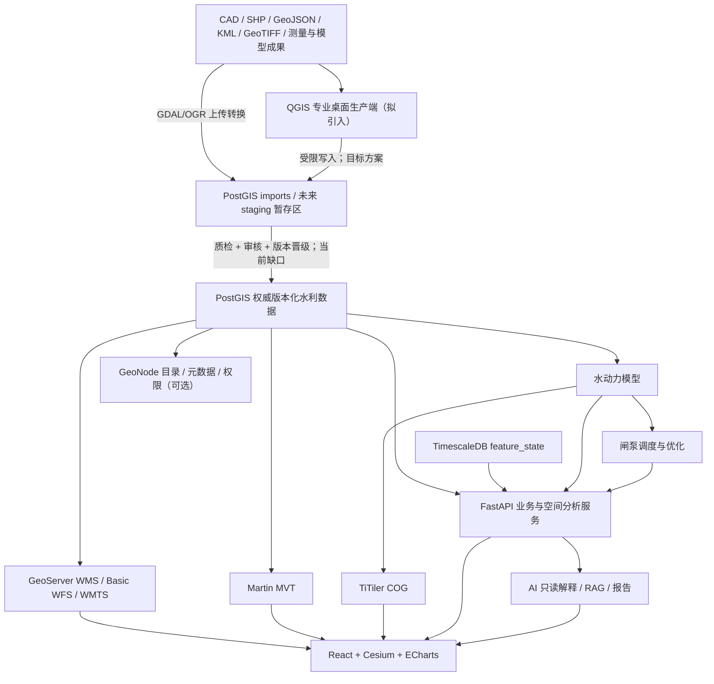
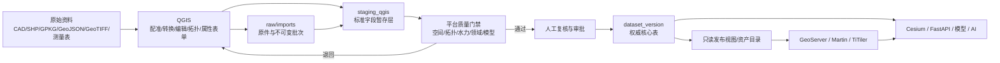

# 大禹·天工 Phase 1 GIS 底座现状审查报告

> 版本：V1.1（核心结论优化版）
> 审查日期：2026-08-13（Asia/Shanghai）
> 审查对象：`dayu-tiangong`，分支 `main`，提交 `921a1d9`
> 任务性质：仅审查，不修改代码、不新增功能、不删除文件
> 目标方向：在保留现有 DGIS 成果的前提下，正式引入 QGIS 作为专业桌面 GIS 数据生产端

## 0. 执行摘要

### 0.1 最终结论

> **核心结论：当前 `dayu-tiangong` 属于“数字孪生 GIS 底座原型”（工程验证级）。面向河道管理、闸泵联合调度、水动力模型耦合、数字孪生展示和 AI 水利助手五项发展目标，综合平均评分为 7.2 / 10。**

当前系统已经不是“Cesium 直接加载若干 GeoJSON”的简单三维展示，也不只是普通 WebGIS。现有技术路线总体正确，主要短板已经从“缺少 GIS 服务底座”转变为“缺少专业桌面数据生产端及受控数据治理闭环”。因此，下一阶段应在保留现有 DGIS 的基础上补齐 QGIS 生产链，而不是重建 GIS 底座。

建议完整保留并继续演进以下核心组件：

- **PostGIS**：唯一业务空间事实源和数据版本载体；
- **GeoServer**：WMS、只读 Basic WFS 和 GeoWebCache/WMTS 发布；
- **Martin**：大规模矢量 MVT 发布；
- **TiTiler**：COG 栅格元数据与瓦片服务；
- **FastAPI**：质量门禁、人工审核、版本晋级及水利业务编排；
- **Cesium**：Web 端二三维数字孪生展示与交互。

上述组件已经构成可持续演进的 DGIS 骨架：

- PostGIS 以 `dataset_version_id` 隔离版本，Cesium 可消费影像、WMS/WMTS、MVT、COG 和 3D Tiles；
- `feature_state`、`simulation_layer`、模型任务和调度运行共同提供时间、空间、版本和来源维度；
- 水动力、闸泵调度、优化与 AI 已通过稳定主键和冻结快照接入 GIS。

当前最主要的问题不再是“缺少 GIS 服务层”，而是缺少成熟的**专业桌面数据生产闭环**和生产治理。尤其包括：

1. 尚未把 QGIS 纳入正式架构、账号、项目模板和标准作业流程；
2. `imports` 暂存能力与权威版本化水利表之间，缺少可审计的字段映射、质检、审批和晋级流水线；
3. 堤防、水库、洪水淹没范围等核心对象仍没有权威领域模型；
4. 当前内置数据、COG 和 3D Tiles 都是 DEMO，水动力模型未完成真实工程率定；
5. FastAPI 尚无平台级认证授权，GeoNode 仍是可选开发配置，生产安全、资产生命周期、备份恢复、观测和容量证据不足；
6. 当前 `main` 与 `origin/main` 同步且工作区在审查开始时干净，但本次运行态复核时 Docker Engine 需重新启动，随后发现常驻容器均为 `Exited (255)`，所以本报告不声称服务在审查时在线。

### 0.2 推荐决策

推荐采用本报告的**方案 B：保留现有 DGIS，正式引入 QGIS 作为专业桌面数据生产端**。

推荐的唯一主数据链路为：

> **QGIS → 暂存区 → 质检 → 人工审核 → 数据版本晋级 → GeoServer / Martin / TiTiler → Cesium**

其中，QGIS 负责专业数据生产，FastAPI 负责质量门禁、审核与版本晋级编排，PostGIS 继续作为贯穿暂存、权威版本和发布视图的唯一业务空间数据库。

QGIS 的正确定位是：

- 数据加载、配准、坐标转换、编辑和拓扑检查；
- 河道、断面、堤防、水库、闸泵等专业数据生产；
- QGIS 项目模板、表单、值域、关系、符号与制图；
- 将成果写入同一 `dayu_tiangong` PostGIS 实例内的受控暂存 schema；
- 由平台完成质量检查、人工审核、版本晋级和只读发布。

必须同时守住四条架构红线：

1. **不新建第二套 GIS 业务数据库**，继续以现有 PostGIS 为唯一空间事实源；
2. **不开放 WFS-T**，GeoServer 保持只读发布边界；
3. **不让 QGIS 直接修改生产核心表**，QGIS 仅写同库受控暂存区；
4. **不推翻现有 DGIS**，不以 QGIS 替代 FastAPI、GeoServer、Martin、TiTiler 或 Cesium。

QGIS 也不得绕过数据版本、模型输入冻结和人工审批；它不是嵌入 React/Cesium 的页面组件，而是与现有 Web 数字孪生平台分工协作的专业桌面生产工具。

## 1. 审查范围、方法与证据等级

### 1.1 审查范围

本次覆盖：

- `frontend`
- `backend`
- `database`
- `geoserver`
- `model`
- `optimization`
- `ai`
- `tools`
- `docker`
- `docs`

并重点核对：

- 前端 Cesium、图层加载、数据来源、坐标和 OGC 能力；
- PostGIS 空间模型、版本、索引、时序和模型结果；
- GeoServer workspace、图层、WMS/WFS/WMTS、安全边界；
- GDAL/OGR、Martin、TiTiler、GeoNode 与 3D Tiles；
- 水利对象完整度与模型、调度、优化、AI 的耦合方式；
- QGIS 引入后的目标职责、数据流和改造优先级。

### 1.2 证据等级

| 等级 | 含义 | 本报告用法 |
| --- | --- | --- |
| E1 | 当前提交中的代码、迁移、配置和测试契约 | 作为现状判断的主要事实来源 |
| E2 | 仓库内既有审查、验收和性能记录 | 作为历史已验证证据，注明其时点与 DEMO 边界 |
| E3 | 本次只读 Git、Docker 与 HTTP 检查 | 作为审查时点的实时状态，不用历史状态替代 |
| E4 | QGIS、GeoServer、PostGIS 官方文档 | 作为目标方案的能力和边界依据 |

本报告不以任务书或旧对话中的早期推断替代当前代码事实。引用对话中“现阶段 GIS 主要偏地图展示”“缺少 GIS 空间服务层”等判断，已被 `921a1d9` 的 DGIS Foundation 实现部分淘汰。

### 1.3 审查限制

- 未修改或执行任何业务数据写入；
- 未启动项目 Compose 栈，避免超出“仅审查”边界；
- Docker Desktop 已按用户指示启动，Engine 版本为 `29.6.2`；
- 实时 `compose ps -a` 显示一次性任务为 `Exited (0)`，常驻服务为 `Exited (255)`；全部本地 HTTP 端点在审查时不可连接；
- 因此运行功能采用“当前代码 + 既有验收记录”判断，实时可用性单独标记为未复核；
- 未使用真实河网、DEM、遥测、BIM、SCADA/PLC 或率定资料进行生产适用性判断。

## 2. 项目结构审查

### 2.1 总体架构图



图中 QGIS 和“暂存到权威版本晋级”是推荐目标；其余为当前已存在的主要架构。

### 2.2 模块职责、技术栈、依赖与合理性

| 模块 | 当前作用 | 主要技术栈 | 关键依赖/被依赖 | 合理性评价 |
| --- | --- | --- | --- | --- |
| `frontend` | 平台页面、GIS 工作台、数据中心、水动力、调度、优化和 AI 交互 | React 18、TypeScript、Vite、Ant Design、CesiumJS、ECharts | 只通过生成客户端访问 FastAPI；GIS 另访问同源 OGC、MVT、COG、3D Tiles | **合理**。页面路由懒加载、生成客户端和 Cesium 图层职责清楚；但 GIS 主组件仍较大，生产权限与错误可观测性不足 |
| `backend` | HTTP 契约、业务编排、空间查询、导入校验、时空目录与上游服务探测 | FastAPI、Pydantic 2、SQLAlchemy 2、GeoAlchemy2、psycopg 3、Celery | 依赖 PostGIS、Redis、GeoServer、Martin、TiTiler及框架无关领域包 | **总体合理**。router/service 分层明确；GIS 被拆为 `gis`、`gis_analysis`、`dgis`、`data_converter`、`geoserver`，边界可辨，但缺平台级认证授权和数据晋级工作流 |
| `database` | 权威关系/空间/时序模型、迁移、播种和服务角色引导 | PostgreSQL 17、PostGIS 3.5、TimescaleDB、Alembic | 为 FastAPI、模型快照、GeoServer、Martin、GeoNode提供事实源 | **方向正确且是核心资产**。单一业务空间源、版本外键、GiST 和迁移体系合理；对象覆盖与数据治理仍需补齐 |
| `geoserver` | 幂等配置 workspace、只读 datastore、12 个图层/SLD、图层组、Basic WFS 和 WMTS 缓存 | GeoServer REST、SLD、Python 引导/验证 | 只读连接 PostGIS；向 Cesium 提供 WMS/WFS/WMTS | **合理**。避免 WFS-T、管理员 REST 不进浏览器边界；生产还需认证、HA、缓存运维和样式发布治理 |
| `model` | 框架无关的一维水动力、网格、河网、断面、闸泵、控制、诊断和结果契约 | Python、Saint-Venant、hydrostatic reconstruction、Rusanov | 输入来自冻结 PostGIS 快照；被 worker、调度和优化调用 | **分层合理**。与 GIS 通过版本化对象和快照耦合，不反向依赖 Web；但当前是简化、未率定模型，不能作为生产决策引擎 |
| `optimization` | PSO、目标/约束评价、候选仿真、Pareto 与来源快照 | Python | 依赖模型任务，不直接改模型或 GIS 数据 | **合理**。推荐与执行授权分离；候选规模、并行度和真实调度约束仍需工程验证 |
| `ai` | RAG、只读工具、来源约束解释、安全门禁和报告生成 | Python、本地检索、可选 OpenAI-compatible LLM、ReportLab | 只读消费 GIS、模型和优化证据 | **边界合理**。不控制设备、不改结果；知识治理、真实规范语料、用户身份和细粒度授权尚不成熟 |
| `tools` | 当前仅保存 Phase 2 模板生成脚本 | Node.js 脚本 | 辅助开发/交付 | **可接受但过薄**。不应将未来 QGIS 业务核心零散放入此目录；QGIS 项目模板、处理模型和插件若建立，应有明确独立所有权 |
| `docker` | 本地/演示环境的数据库、Redis、迁移、种子、GeoServer、Martin、TiTiler、FastAPI、worker、前端及可选 GeoNode 编排 | Docker Compose、Nginx、定制镜像 | 装配全部运行组件和具名卷 | **开发演示合理**。服务分工、健康依赖、最小权限角色较好；单机、固定端口和本地卷不等于生产部署 |
| `docs` | 架构、模型、调度、优化、AI、基准与各阶段审查 | Markdown、Mermaid | 描述当前能力与历史验收 | **资料较完整但有漂移**。顶层 README/架构文档仍主要写至 Phase 1D/Phase 6，对 DGIS Foundation、QGIS 目标和实时运行边界更新不足 |

### 2.3 模块依赖评价

积极方面：

- 前端 API 调用集中在 `frontend/src/api/generated/client.ts`，符合统一契约原则；
- 后端 router 主要负责输入和响应，业务逻辑进入 service；
- `model` 和 `optimization` 保持框架无关，不读取前端或 GeoServer；
- PostGIS 是唯一业务空间事实源，GeoServer 数据目录、COG/3D 文件和 GeoNode 元数据没有被误当成第二套业务库；
- 静态设计状态、动态时空状态、模拟任务状态和推荐状态没有复用同一个字段；
- AI 工具为只读白名单，未进入控制执行链。

主要结构债务：

- 数据导入存在两条尚未完全统一的链路：业务 `Excel/CSV/GeoJSON → 核心表` 与 DGIS `GDAL → imports/GeoJSON/COG`；
- `imports` schema 与 `dataset_version` 核心表之间没有统一的批次、映射、审核、晋级和回滚对象；
- `docs/architecture.md` 尚未完整反映 Martin、TiTiler、TimescaleDB、GeoNode、3D Tiles 和未来 QGIS 的现行/目标边界；
- 部分前端 GIS 组件以一个大型 `CesiumMap.tsx` 管理多类 provider、动态对象、选择和性能探测，后续扩展专业工具时有继续膨胀风险。

## 3. GIS 技术栈审查

### 3.1 Cesium 使用方式

当前 Cesium 不是单一静态容器，已经承担多协议数字孪生展示：

- Esri World Imagery 影像底图，失败时明确降级到经纬网；
- GeoServer WMS，用于中比例尺制图、透明叠加和 GetFeatureInfo；
- GeoWebCache/WMTS，用于缓存图层的小比例尺展示；
- Martin MVT，通过 Cesium 原生 `MVTDataProvider` 加载；
- TiTiler COG，通过受控 FastAPI 栅格代理和 URL 模板加载；
- Cesium 3D Tiles，用于版本登记的三维工程设施；
- Cesium primitives/labels，用于水位、流速、流向、闸泵状态、注记和空间分析结果；
- 相机视域驱动的 bbox、注记刷新、服务性能探测和图层顺序控制。

这证明平台已经具备数字孪生展示的技术骨架。但 Cesium 是**Web 展示和交互引擎**，不应承担 QGIS 的精细编辑、配准、拓扑修复、批处理、复杂制图和数据生产职责。

### 3.2 图层加载与数据来源

| 数据类型 | 当前来源 | 发布/接口 | 前端消费 | 评价 |
| --- | --- | --- | --- | --- |
| 河道、河段、节点、断面、闸、泵 | 版本化 PostGIS 表 | GeoServer WMS/WMTS/WFS；FastAPI 属性 | Cesium imagery + 业务详情 | 主链合理 |
| 行政区、道路、地名、水名、POI、注记 | PostGIS | GeoServer WMS/WMTS/WFS；FastAPI 搜索/注记 | Cesium | DEMO 底图数据，非权威公共底图 |
| 大规模矢量 | PostGIS `tiles.*` 函数 | Martin MVT | Cesium MVTDataProvider | 架构合理，需真实规模压测与分级简化 |
| 水位、流速、风险等栅格结果 | `simulation_layer` 元数据 + COG 文件 | TiTiler，经 FastAPI 受控代理 | Cesium URL template | 已完成原型闭环，缺真实任务资产生命周期 |
| 时空对象状态 | TimescaleDB `feature_state` | FastAPI 查询/回放 | Cesium 动态叠加 | 状态与静态设计字段分离，方向正确 |
| 三维设施 | `simulation_layer`/3D Tiles 资产 | Nginx `/3d/` | Cesium3DTileset | DEMO 资产，缺 BIM/倾斜摄影生产流程 |
| 外部影像底图 | ArcGIS World Imagery | 第三方在线服务 | Cesium | 演示有效；生产需许可、网络、缓存和国产/内网替代策略 |

### 3.3 坐标处理

- 权威业务空间存储统一使用 CGCS2000 / EPSG:4490；
- 迁移中对历史空间列做了实际 `ST_Transform`，不是只改 SRID 标签；
- MVT 发布时转换到 EPSG:3857 瓦片空间；
- 米制缓冲和最近距离使用 PostGIS `geography`；
- 水动力距离使用米制断面桩号和河段长度，不直接把 4490 的经纬度差当作米；
- GDAL 转换白名单允许 4326、4490、3857。

评价：坐标与量纲意识较强。未来引入 QGIS 后仍需明确：

1. EPSG:4490 是交换和权威存储基准；
2. EPSG:3857 仅用于 Web 瓦片显示，不用于工程测距、面积或模型计算；
3. 工程测量、缓冲、面积和断面处理应按项目所在地选用合适的 CGCS2000 投影坐标系，并记录转换链；
4. 每个导入批次应保存源 CRS、目标 CRS、转换参数、原文件哈希和操作人，而不只在最终表中保留 SRID。

### 3.4 WMS/WFS 支持

- WMS：已配置并用于 12 个图层和 `dayu_basemap` 图层组；
- WMTS：7 个图层进入 GeoWebCache，`CQL_FILTER=dataset_version_id=N` 被纳入缓存键；
- WFS：配置为 GeoServer Basic 服务，仅开放查询与获取；
- WFS-T/LockFeature：明确关闭；
- 浏览器侧同源代理屏蔽 GeoServer `/rest`、`/web` 和 `/gwc/rest`；
- GetFeatureInfo 返回稳定主键后，FastAPI 再返回业务详情，避免显示协议成为业务权威接口。

这一边界是合理的。GeoServer 官方文档也将 Basic WFS 定义为只读服务，而 Transactional 才提供创建、删除和更新。未来 QGIS 编辑应直接连接受限 PostGIS 暂存 schema，不应为了“接入 QGIS”而打开 WFS-T。

### 3.5 A/B/C 分类

| 分类 | 是否符合 | 原因 |
| --- | --- | --- |
| A 简单三维展示 | 否 | 已有标准服务、版本、空间分析、MVT/COG、时空回放和模型联动 |
| B WebGIS 平台 | 是 | WMS/WFS/WMTS、查询、图层管理、空间分析、导入和制图已形成平台能力 |
| C 数字孪生 GIS 底座 | **原型级是，生产级否** | 已有状态、时间、模型、调度、栅格、3D 和来源边界；但真实数据、同化、率定、资产治理、权限、HA 和运维证据不足 |

## 4. 空间数据管理审查

### 4.1 数据存储类型判断

当前系统以 **PostgreSQL + PostGIS** 为权威空间数据库，同时使用：

- TimescaleDB 保存带空间位置的时序状态；
- 文件/具名卷保存大型 COG 和 3D Tiles 资产；
- GeoServer 数据目录保存服务目录和缓存，不保存第二套业务事实；
- 后端存储目录暂存上传、转换和报告文件。

因此它不是普通关系数据库方案，也不是以 Shapefile/GeoJSON 为核心的文件式 GIS。文件是输入或大型资产载体，核心对象仍数据库化。

### 4.2 核心水利对象覆盖

| 对象 | 当前支持度 | 现有证据 | 关键缺口 |
| --- | --- | --- | --- |
| 河道 | 高 | `river` LineString，编码、名称、等级、长度、状态、版本、GiST；另有节点、河段和连接 | 缺流域/行政归属、河道等级词典、工程测量来源、完整数据谱系等生产字段 |
| 横断面 | 中高 | `cross_section` Point，编码、名称、桩号、剖面点、糙率、最低高程、测量日期、版本 | 点位与剖面数组已支持模型，但缺断面线几何、左右岸标志/堤顶控制点、测量基准、外部模型映射版本等 |
| 堤防 | 无权威模型 | 搜索未发现独立 `dike/levee/embankment` 领域表和发布层 | 必须新增线/面对象、岸别、桩号、堤顶高程、防洪标准、隐患与巡检关联 |
| 闸 | 高（原型） | `gate` Point，设计参数、河段/上下游节点、开度约束、流量、静态状态；另有动态状态和结构结果 | 缺设备资产台账、测点映射、校验/检修历史、真实控制系统只读接口 |
| 泵站 | 高（原型） | `pump` Point，设计流量、扬程、功率、效率/扬程曲线、机组数、启停约束、节点和动态状态 | 缺机组级资产、实时测点映射、检修/可用性来源和率定曲线治理 |
| 水库 | 无权威模型 | 未发现独立 reservoir 领域表、库容曲线和发布层 | 必须新增库区、坝体、控制建筑物、库容/水位曲线、调度边界和模型映射 |
| 洪水范围 | 部分 | `simulation_layer` 支持 water_level/velocity/flood_risk COG；专题图和动态水位存在 | 没有正式 flood_extent/flood_result Polygon 领域模型；水深 DEMO COG 的 `layer_type` 仍登记为 `water_level`，语义需收敛 |

### 4.3 版本、索引与完整性

优势：

- 核心空间对象普遍有 `dataset_version_id`；
- 业务编码按数据版本唯一；
- 空间列声明 SRID 4490 并建立 GiST；
- 模型任务、调度计划、优化任务均冻结数据版本和输入快照；
- 空间查询使用 `ST_Intersects`、`ST_DWithin`、`ST_Distance` 等索引友好函数；
- 自动校验覆盖几何有效性、版本一致性、断面桩号/高程、闸泵参数、拓扑、边界和模型参数。

缺口：

- `dataset_version` 只有基本说明字段，缺 draft/review/approved/published/retired 生命周期；
- 缺父版本、变更集、来源批次、审核人、审批时间、发布清单和差异摘要；
- GDAL 导入到 `imports` 使用覆盖语义，尚未与业务版本和审核链绑定；
- 没有生产级数据目录、字段字典、值域表、测量基准和质量规则版本；
- 大型文件资产缺对象存储、校验和、不可变路径、保留和清理策略。

## 5. GeoServer 审查

### 5.1 当前完成度

| 项目 | 现状 |
| --- | --- |
| 部署 | Compose 使用 GeoServer `2.28.0` 镜像和持久数据卷 |
| workspace | `dayu` |
| datastore | `dayu_postgis`，连接唯一业务 PostGIS |
| 账号 | `dayu_geoserver` 最小权限、只读事务、无继承 |
| 图层 | 12 个：河道、河段、节点、断面、闸、泵、注记、行政区、道路、地名、水名、POI |
| 样式 | 12 个源码管理 SLD |
| 图层组 | `dayu_basemap` |
| WMS | 支持，并有能力文档和 GetMap 验证脚本 |
| WFS | Basic 只读；验证脚本解析操作集合，拒绝 Transaction/LockFeature |
| WMTS | 7 个缓存层；数据版本过滤进入缓存参数 |
| 管理面 | Nginx 不向浏览器公开 REST/Web/GWC REST |

### 5.2 距离生产级 GIS 服务的差距

| 维度 | 当前 | 生产目标 |
| --- | --- | --- |
| 身份与权限 | GeoServer 数据库账号只读；平台 API 基本无用户认证 | 统一 SSO/OIDC、用户/组织/项目权限、服务访问审计、QGIS 编辑角色分离 |
| 高可用 | 单实例、单机 Compose | GeoServer/代理多实例、共享或外置状态、明确故障切换 |
| 缓存 | 版本参数隔离和本地 GWC | 缓存预热、失效、容量、水位和命中率监控，发布版本与缓存原子切换 |
| 数据发布 | 引导脚本固定 12 表 | 受控发布视图、图层目录版本、样式审查、自动回滚 |
| 观测 | 健康检查和验收脚本 | 指标、追踪、结构化日志、慢请求、OGC 错误率和告警 |
| 安全 | 管理面同源屏蔽、只读 DB 角色 | TLS、网关认证、速率限制、CORS/安全头、密钥管理、漏洞与镜像治理 |
| 容量 | DEMO 热缓存延迟样本 | 真实要素/栅格规模、并发、冷缓存、长时运行和容量边界 |
| 灾备 | 具名卷保留 | 数据库和服务目录备份、恢复演练、RPO/RTO |

## 6. GIS 数据流程审查

### 6.1 当前实际流程

当前存在三条互补链路：

```text
链路 1：业务对象导入
Excel / CSV / GeoJSON
  → FastAPI 行级解析与 Pydantic 校验
  → 原子写入版本化 river / cross_section / gate / pump
  → 数据质量检查 / 拓扑生成
  → GeoServer / FastAPI / 模型快照

链路 2：通用空间资产转换
SHP ZIP / GeoJSON / KML / DXF / GeoTIFF
  → 上传安全校验
  → GDAL/OGR 检查与坐标转换
  → imports schema / GeoJSON / COG
  → 目前缺少统一的审核和核心表晋级步骤

链路 3：模型结果发布
冻结版本化模型输入
  → 水动力 / 调度 / 优化任务
  → 关系结果 + feature_state + simulation_layer
  → FastAPI / TiTiler / 3D Tiles
  → Cesium 时间与空间展示
```

### 6.2 是否满足 QGIS → PostGIS → GeoServer → Cesium

| 环节 | 当前状态 | 判断 |
| --- | --- | --- |
| QGIS 数据生产 | 未正式纳入 | **不满足** |
| PostGIS 权威存储 | 已完成 | 满足 |
| GeoServer 发布 | 已完成只读 WMS/WFS/WMTS 主链 | 满足 |
| Cesium 展示 | 已完成多协议加载 | 满足 |
| 版本/模型联动 | 已完成主要契约 | 满足 |
| 暂存—审核—晋级 | 只有部分导入与校验能力 | **不完整** |

因此标准流程完成度约为“后 3/4 已具备，专业生产入口与治理闸门缺失”。

### 6.3 推荐的 QGIS 目标数据流



关键原则：QGIS 编辑者只写 `staging_qgis`，核心表通过服务端事务晋级；GeoServer/Martin 只读发布；Cesium 不编辑权威几何。

## 7. 水利专业 GIS 能力审查

### 7.1 河道

| 能力 | 现状 | 评价 |
| --- | --- | --- |
| 中心线 | `river.geometry` LineString | 已支持 |
| 河段属性 | `river_segment`、长度、上下游节点 | 已支持模型所需最小集合 |
| 河流编码 | `river.code`，版本内唯一 | 已支持 |
| 河网拓扑 | 全部折点生成节点/河段/连接，可追踪上下游 | 已支持原型；有向环暂不支持 |
| 专业编辑 | Web CRUD/导入为主 | QGIS 应补齐捕捉、拓扑修复、线性参考和批处理 |

### 7.2 横断面

| 能力 | 现状 | 评价 |
| --- | --- | --- |
| 断面编号 | `section_code` | 已支持 |
| 桩号 | `station`，米制并校验在河长范围内 | 已支持 |
| 高程数据 | `points` 剖面数组、`elevation_min` | 已支持模型原型 |
| 模型关联 | 通过版本、河道、模型输入快照和任务结果关联 | 已支持内部模型；缺 MIKE/HEC-RAS 外部模型映射 |
| 空间几何 | 当前为代表点 | 不足。专业 GIS 还需断面线、左右岸与测量基准 |

### 7.3 闸泵

| 能力 | 现状 | 评价 |
| --- | --- | --- |
| 空间位置 | Point，EPSG:4490 | 已支持 |
| 设计/水力参数 | 闸宽高、过流、开度约束；泵 Q-H/Q-η、机组与启停约束 | 原型较完整 |
| 调度状态 | 动态结果和 `feature_state`，不回写静态 status | 状态语义合理 |
| 调度审计 | 计划、动作、规则、运行、事件、约束和结果 | 已形成模拟闭环 |
| 生产设备接入 | 无 SCADA/PLC 下发 | 正确保持禁区；未来先做只读同化和人工审批 |

### 7.4 洪水成果

| 能力 | 现状 | 评价 |
| --- | --- | --- |
| 水位 | 断面/节点时序、动态注记和专题图 | 已支持原型 |
| 水深 | DEMO COG 资产存在 | 仅演示；领域命名和任务生产流程未完成 |
| 流速/流向 | 断面结果、COG、Cesium 动态箭头 | 已支持原型 |
| 淹没范围 | 无权威 Polygon 结果模型 | 关键缺口 |
| 风险区 | DEMO flood_risk COG | 有展示骨架，缺真实风险规则、版本和验证 |

### 7.5 其他专业对象缺口

未来河道管理和防洪评价至少还应规划：

- 堤防/护岸；
- 水库/湖泊/调蓄区及库容曲线；
- 桥梁、涵洞、倒虹吸、溢洪道等通用水工建筑物；
- 水文/雨量/水位/流量监测站及测点映射；
- 流域、子流域、汇水区；
- DEM/地形版本、测量控制点和高程基准；
- 洪水淹没范围、最大水深/流速/到达时间和风险分区；
- 防洪保护对象、人口/建筑/道路等暴露度对象；
- 工程档案、巡检、隐患和附件关联。

## 8. 与未来闸泵调度平台的匹配分析

目标组合为：

```text
GIS + 水动力模型 + 优化算法 + AI
```

### 8.1 五类目标支持度

| 目标 | 评分 | 当前支持程度 | 结论 |
| --- | ---: | --- | --- |
| 河道管理 | **7.0** | 中高 | 河道、断面、拓扑、版本、导入和校验具备；专业桌面编辑与对象扩展不足 |
| 闸泵联合调度 | **7.5** | 高（仿真原型） | 闸泵水力、约束、计划/规则、异步运行、对比和审计已贯通；无真实设备和实时同化 |
| 水动力模型耦合 | **7.5** | 中高（内部模型） | 冻结快照、稳定主键、任务来源和 GIS 结果联动较好；简化模型未率定，外部模型适配不足 |
| 数字孪生展示 | **8.0** | 中高（底座原型） | 多协议图层、时空状态、COG、MVT、3D Tiles 已具备；真实状态源、资产生产和规模验证不足 |
| AI 水利助手 | **6.0** | 中（安全原型） | 有只读工具、来源、RAG、报告与双重门禁；真实知识治理、身份授权和工程证据不足 |

五项目标算术平均分为 **7.2 / 10**。该分数表示当前已具备工程验证级底座和较清晰的演进路径，不表示已经达到生产调度、实时控制或行业验收水平。

### 8.2 必须改造部分

P0 必须项：

1. 引入 QGIS 受控生产端和标准项目模板；
2. 建立 `raw/imports → staging_qgis → validation → approval → dataset_version → publish` 流程；
3. 建立 QGIS 编辑、审核、平台服务、GeoServer、Martin 的独立最小权限角色；
4. 补齐堤防、水库、洪水淹没范围三个一级领域模型；
5. 增强数据版本生命周期、来源批次、审核和发布审计；
6. 平台统一认证授权，禁止匿名写入 GIS、模型、调度和 AI 管理接口；
7. 用真实工程数据做坐标、拓扑、模型率定、容量和制图验收。

P1 重要项：

- QGIS 表单、关系、值域、拓扑规则、处理模型和样式规范；
- COG/3D Tiles 资产登记、校验和、对象存储和生命周期；
- GeoServer 发布视图、缓存预热/失效和监控；
- 外部 MIKE11/MIKE21/HEC-RAS 等模型的对象 ID、断面和结果映射契约；
- 时空状态的真实遥测接入、质量码、事件时间和乱序处理；
- 生产部署、备份恢复、告警、审计和灾备。

## 9. 技术债务与主要问题清单

### 9.1 分级问题清单

| 编号 | 优先级 | 问题 | 影响 | 建议方向 |
| --- | --- | --- | --- | --- |
| GIS-01 | P0 | QGIS 尚未进入正式架构和 SOP | CAD、测量、矢量编辑与拓扑质检缺专业入口 | 建立 QGIS LTR 标准项目、连接、表单、规则和交付清单 |
| GIS-02 | P0 | `imports` 到核心版本表无统一晋级工作流 | 临时数据可能绕过字段映射、审核和版本边界 | 建立批次、暂存、校验、审批、发布和回滚状态机 |
| GIS-03 | P0 | 堤防、水库、洪水淹没 Polygon 缺失 | 河道管理、防洪评价和二维成果不完整 | 先做领域模型和数据字典，再发布服务和 UI |
| GIS-04 | P0 | FastAPI 缺平台级认证/RBAC | 写接口、调度、知识和数据管理不具备生产安全边界 | 接入统一身份、项目/角色权限和审计 |
| GIS-05 | P0 | 当前数据和模型均为 DEMO/未率定 | 不能用于工程决策或真实调度 | 引入权威数据、率定、验证与人工审批门禁 |
| GIS-06 | P1 | 版本对象缺完整生命周期和来源谱系 | 不能证明某地图/模型输入由谁、何时、依据何物发布 | 扩展父版本、批次、哈希、审核、批准、发布和退役 |
| GIS-07 | P1 | 横断面空间模型仅为点 | 难以表达真实断面方向、左右岸、河槽和堤顶 | 增加断面线/控制点或规范化剖面子表 |
| GIS-08 | P1 | 栅格/3D 资产仍依赖本地卷和演示初始化 | 不利于任务化生产、扩展、校验和清理 | 对象存储 + 不可变 URL + checksum + 生命周期 |
| GIS-09 | P1 | GeoNode 为可选开发 profile，生产身份与元数据闭环未完成 | 目录、搜索、共享和权限难以成为正式能力 | 先决定 GeoNode 是否是正式目录；若是则补齐 SSO/worker/存储/代理 |
| GIS-10 | P1 | 真实规模与并发证据不足 | DEMO 延迟无法代表万/百万级数据与冷缓存 | 按真实数据量、缩放级别、并发和冷/热缓存压测 |
| GIS-11 | P1 | `CesiumMap.tsx` 聚合职责偏多 | 新增编辑/量测/三维工具时维护风险上升 | 按 provider、selection、dynamic state、camera 和 tools 拆分 hooks/services |
| GIS-12 | P1 | 顶层架构文档未完整同步 DGIS Foundation | 新成员可能沿用已过时的 Phase 1D 认知 | 将当前事实与未来 QGIS 计划分开维护 |
| GIS-13 | P2 | 外部影像依赖公网 Esri | 内网、许可、网络波动和数据合规风险 | 规划天地图/自有影像/离线缓存与来源标识 |
| GIS-14 | P2 | MVT 函数和属性裁剪仍为固定原型 | 更大规模时可能传输冗余或几何过密 | 按 zoom 简化、裁剪字段、预聚合并做查询计划门禁 |

### 9.2 架构耦合评价

当前没有发现必须“推翻重构”的致命耦合：

- PostGIS、空间服务、业务 API、模型、优化和 AI 的主要所有权已分开；
- 生成客户端保持前后端契约同步；
- 模型输入通过快照而非运行时随意读库；
- 模拟/推荐不等于执行；
- GeoServer 与 Martin 均是只读发布者。

真正的架构风险是未来把 QGIS 直接接到 `public` 核心表并授予宽泛写权限，或者为 QGIS 单独新建一套业务库。两者都会破坏当前已经建立的数据版本和单一事实源原则。

## 10. 三种改造方案比较

### 10.1 方案 A：仅保留现有架构继续优化

内容：继续使用 Web 数据中心、GDAL 上传和 Cesium，不正式引入 QGIS。

| 维度 | 评价 |
| --- | --- |
| 成本 | 低 |
| 风险 | 短期低、长期中高 |
| 收益 | 能继续快速演示和扩展 Web 功能 |
| 局限 | CAD/测量/复杂编辑、拓扑修复、制图和水利工程师桌面工作流不足；Web 端容易被迫重复造专业 GIS 工具 |
| 结论 | 不满足用户已确认的最终方向，不推荐作为目标方案 |

### 10.2 方案 B：在现有 DGIS 上引入 QGIS 受控生产端（推荐）

内容：保留现有 PostGIS、GeoServer、Martin、TiTiler、FastAPI、Cesium、模型、优化和 AI；新增 QGIS 标准项目及受控生产流程。

| 维度 | 评价 |
| --- | --- |
| 成本 | 中 |
| 风险 | 低至中，可按 schema/角色/版本逐步上线 |
| 收益 | 直接获得成熟编辑、配准、拓扑、处理、制图和 PostGIS 工作流；复用当前全部 DGIS 成果 |
| 关键条件 | QGIS 只写暂存层；核心晋级由平台审核事务完成；不新增第二数据库；不开放 WFS-T |
| 结论 | **收益最高、风险最低的目标方案** |

QGIS 官方文档表明其 PostgreSQL/PostGIS provider 和 DB Manager 可加载、管理、导入/导出空间数据库图层，并提供事务组、地理配准和拓扑检查能力。这正好补齐当前系统的桌面生产缺口，而无需重写 WebGIS 内核。

### 10.3 方案 C：完全重构 GIS 底座

内容：重排目录或重建数据库、空间服务、前端 GIS 和模型接口。

| 维度 | 评价 |
| --- | --- |
| 成本 | 极高 |
| 风险 | 极高 |
| 收益 | 只有在现有基础存在不可修复架构错误时才成立 |
| 损失 | 会重复建设已经完成的 PostGIS 版本、GeoServer、MVT、COG、时空状态、模型联动、生成客户端和安全边界 |
| 结论 | 当前没有证据支持，明确不推荐 |

## 11. GIS 能力评分（0–10）

评分口径：5 分代表具备可用原型，8 分代表较完整工程能力，10 分代表已有真实生产数据、容量、安全、运维和行业验收闭环。

| 能力 | 分数 | 依据 |
| --- | ---: | --- |
| 地图展示 | **8.0** | 影像、WMS/WMTS、MVT、COG、3D Tiles、图层树、注记、时间轴和降级提示齐全；真实三维/地形资产与内网底图不足 |
| 数据管理 | **7.0** | PostGIS 单一事实源、版本、GiST、迁移、导入、校验、TimescaleDB 和资产目录已具备；QGIS、审核晋级、谱系和生产资产治理缺失 |
| 空间分析 | **7.0** | 搜索、框选、米制缓冲、最近设施、上下游追踪、MVT、A/B 对比和专题图已具备；专业水文地形分析与大型数据证据不足 |
| 水利对象管理 | **6.5** | 河道、拓扑、断面、闸泵较完整；堤防、水库、淹没范围等一级对象缺失，断面空间语义仍偏简化 |
| 模型耦合 | **7.5** | 稳定 ID、版本、冻结快照、结果时序、调度/优化和 GIS 联动良好；简化模型未率定，外部模型接口与真实结果生产链不足 |
| 数字孪生时空能力 | **6.5** | feature_state、回放、simulation_layer、COG、3D Tiles 已成骨架；实时同化、质量码、BIM/遥测和生产时空容量不足 |
| 安全与运维 | **4.5** | 发布服务最小权限和 AI 控制门禁较好；平台认证、HA、密钥、备份演练、监控和生产运行证据不足 |

上表七项用于诊断 GIS 底座的具体强项和短板，不直接进行简单平均。按任务书要求的河道管理、闸泵联合调度、水动力模型耦合、数字孪生展示和 AI 水利助手五项目标评分（见 8.1 节），算术平均分为：

> **7.2 / 10**（数字孪生 GIS 底座原型、工程验证级；尚未达到生产级数字孪生平台）。

## 12. 推荐目标架构

### 12.1 组件责任

| 组件 | 目标责任 | 明确不负责 |
| --- | --- | --- |
| QGIS | 数据生产、编辑、配准、拓扑检查、属性维护、桌面制图、处理模型 | Web 在线展示、模型任务编排、生产发布审批、设备控制 |
| PostGIS | 唯一权威空间事实、暂存、版本、关系、索引、质量和发布视图 | 存储大型二进制 COG/3D 本体 |
| GeoServer | WMS、Basic WFS、WMTS、SLD 制图 | 业务写入、版本审批、模型逻辑 |
| Martin | 大规模矢量瓦片 | 属性业务 API、编辑 |
| TiTiler | COG 元数据和瓦片 | 任意 URL 代理、资产审批 |
| FastAPI | 业务契约、质量门禁、版本晋级、空间分析、资产目录、模型/调度/AI 编排 | 重写成熟 GIS 渲染引擎 |
| Cesium | Web 二/三维展示、查询、联动和回放 | 专业桌面编辑、权威数据写入 |
| GeoNode | 若正式采用：目录、元数据、共享和权限门户 | 水利业务逻辑、模型和调度所有权 |

### 12.2 PostGIS schema 与角色建议

建议仍使用同一个 `dayu_tiangong` 数据库，按职责隔离：

```text
raw / imports       原始批次、GDAL/QGIS 临时导入
staging_qgis        标准字段暂存、待质检/待审核
core 或 public      版本化权威水利对象（迁移管理）
publish             只读发布视图/物化视图
tiles               Martin 白名单函数
geonode_assets      GeoNode 资产空间（若保留）
```

建议角色：

- `dayu_qgis_editor`：仅写 `staging_qgis`，读必要参考层；
- `dayu_qgis_reviewer`：读暂存和质量结果，可提交审核意见，不直接改核心；
- `dayu_publisher`：仅由受控后端事务使用，负责晋级和发布；
- `dayu_geoserver`：继续只读 `publish/core`；
- `dayu_martin`：继续只读指定表并执行 `tiles.*`；
- 应用运行、迁移和 DBA 角色继续分离。

### 12.3 QGIS 标准项目建议

应形成一个版本化的 QGIS LTR 项目模板，至少包含：

- EPSG:4490 权威图层和项目所在地的 CGCS2000 投影分析配置；
- PostGIS 暂存/参考/发布连接的明确只读或可编辑标识；
- 河道、断面、堤防、水库、闸泵、监测站、洪水成果图层组；
- 字段别名、必填项、值域、默认值、关系引用和附件表单；
- 捕捉、拓扑编辑、几何检查和领域质量规则；
- QML/SLD 样式来源与转换责任；
- 地理配准、CAD/DXF、SHP/GPKG/GeoJSON、GeoTIFF/DEM 的标准导入模型；
- 批次 ID、source_crs、target_crs、source_hash、operator、survey_time、quality_status 等来源字段；
- “提交暂存”“运行质检”“查看问题”“申请晋级”的明确工作流入口。

是否开发 PyQGIS 插件应在标准手工流程稳定后决定。首期可以先用 QGIS 项目模板、Processing 模型、数据库视图和平台 API，避免过早维护大型插件。

## 13. Phase 1 开发路线建议

本节只提出路线，不包含代码实现。

### Phase 1.0：基线冻结与数据契约

交付：

- 冻结当前 `921a1d9` 的 API、数据库和发布图层清单；
- 明确 QGIS、PostGIS、GeoServer、FastAPI、Cesium 的责任边界；
- 完成河道、断面、闸、泵及新增堤防/水库/洪水范围的数据字典；
- 确定权威坐标、高程和单位标准；
- 定义数据批次、版本生命周期和角色矩阵。

验收门禁：不新建第二业务数据库；不开放 WFS-T；不破坏现有生成客户端和模型快照。

### Phase 1.1：QGIS 最小生产端

交付：

- 选定并固定 QGIS LTR 版本；
- 标准 `.qgz` 项目、图层树、表单、值域、关系、QML 样式；
- CGCS2000 坐标转换、地理配准、DXF/SHP/GPKG/GeoJSON/GeoTIFF 流程；
- 捕捉、拓扑和几何质量规则；
- `dayu_qgis_editor` 最小权限账号，只写暂存 schema。

验收门禁：QGIS 无权修改已发布版本；凭据不写入项目文件；样例数据可完整追溯到原始批次。

### Phase 1.2：暂存、质检、审核与版本晋级

交付：

- `import_batch`、字段映射、问题清单、审核记录和发布记录；
- `staging_qgis` 到核心表的确定性转换；
- 复用并扩展现有空间/水力/拓扑/模型校验；
- 人工审批后原子创建/更新 `dataset_version`；
- 失败不产生半版本，支持回滚和差异预览。

验收门禁：同一批次重复提交幂等；错误数据不可晋级；发布版本可冻结进入模型且哈希稳定。

### Phase 1.3：水利对象补齐

交付优先顺序：

1. 堤防/护岸；
2. 水库/调蓄区；
3. 洪水淹没范围及水深、流速、到达时间；
4. 断面线、左右岸和高程基准；
5. 监测站与设备测点映射；
6. 通用水工建筑物和暴露度对象。

验收门禁：每类对象同时具备 PostGIS 模型、QGIS 表单/规则、质量校验、只读发布和 Cesium 查询，不只增加前端图标。

### Phase 1.4：发布与制图闭环

交付：

- `publish` 视图及版本过滤；
- QGIS QML 与 GeoServer SLD 的来源/转换规范；
- GeoServer 图层、Martin 瓦片、TiTiler 资产的发布清单；
- 缓存预热/失效、失败回滚和审计；
- Web 专题图与 QGIS 工程制图的一致图例/字段口径。

验收门禁：旧版本缓存不串入新版本；发布失败不影响当前在线版本。

### Phase 1.5：真实工程验收与生产硬化

交付：

- 一套经授权的真实河道/断面/闸泵/DEM/成果数据；
- 坐标、高程、拓扑和属性人工抽检；
- 模型率定与独立验证；
- 真实规模 MVT、WMS/WMTS、COG、时空查询和并发压测；
- SSO/RBAC、TLS、密钥、备份恢复、监控、告警和灾备演练；
- 明确实时数据仍为只读同化、设备控制必须人工审批和独立安全系统。

验收门禁：在上述证据完成前，继续标注 DEMO/原型，不宣称可用于生产调度。

## 14. 最终建议

1. **不推翻现有 GIS 底座。** 当前 PostGIS + GeoServer + Martin + TiTiler + FastAPI + Cesium 的技术方向正确，且已经与模型、调度、优化和 AI 形成稳定边界。
2. **必须引入 QGIS，但只作为专业生产端。** 它解决数据编辑、配准、拓扑、处理和制图，不替代 Web 端或服务端。
3. **QGIS 不能直接写生产核心表。** 采用同库 schema 隔离和最小权限，通过质检、审核和版本晋级进入权威表。
4. **保持 GeoServer Basic WFS 只读。** QGIS 使用受限 PostGIS 连接，不以 WFS-T 作为生产编辑通道。
5. **优先补数据治理与对象模型，而非继续堆地图按钮。** 堤防、水库、洪水范围、断面线和数据谱系优先级高于新增视觉特效。
6. **将“原型能力”和“生产能力”分开验收。** 当前技术评分较高，但真实数据、模型率定、安全、容量、资产生命周期和运维仍是生产门槛。

综合判断：

> 大禹·天工当前属于综合评分 **7.2 / 10** 的“数字孪生 GIS 底座原型”。下一步不是“用 QGIS 重做现有 GIS”，而是“让 QGIS 成为现有权威 PostGIS 体系的专业数据生产入口”，形成 **QGIS → 暂存区 → 质检 → 人工审核 → 数据版本晋级 → GeoServer/Martin/TiTiler → Cesium** 的受控主数据链路，并由晋级后的权威数据继续支撑水动力、调度和 AI。

## 15. 关键代码证据索引

| 事实 | 主要证据 |
| --- | --- |
| 服务总编排与单一数据库 | `docker/docker-compose.yml` |
| Nginx OGC/MVT/3D 公开边界 | `docker/nginx.conf` |
| PostGIS 核心对象、任务和结果 | `backend/app/gis/models.py` |
| DGIS 时空表、schema 与 MVT 函数 | `database/migrations/versions/20260813_0010_dgis_foundation.py` |
| Martin 最小发布面 | `docker/martin-config.yaml`、`database/bootstrap_dgis.py` |
| GeoServer workspace、图层、只读角色和 WFS | `geoserver/bootstrap.py`、`geoserver/verify.py` |
| GIS 属性/空间服务 | `backend/app/gis/*`、`backend/app/gis_analysis/*` |
| 时空状态、COG、3D 目录 | `backend/app/dgis/*` |
| GDAL/OGR 导入转换 | `backend/app/data_converter/*` |
| 业务对象原子导入与校验 | `backend/app/import_service/*`、`backend/app/validation/*` |
| Cesium 多协议加载 | `frontend/src/components/gis/CesiumMap.tsx`、`frontend/src/components/dgis/*` |
| 数据版本切换语义 | `frontend/src/context/DatasetVersionContext.tsx` |
| 生成 API 客户端 | `frontend/src/api/generated/client.ts` |
| 模型输入冻结与来源 | `backend/app/model_engine/provenance.py`、`backend/app/dataset/service.py` |
| 调度与优化快照 | `backend/app/dispatch/snapshot.py`、`optimization/provenance/snapshot.py` |
| AI 只读和安全边界 | `ai/tools/registry.py`、`ai/guardrails/policy.py` |

## 16. 官方参考

- [QGIS：PostgreSQL/PostGIS 数据源与字段](https://docs.qgis.org/3.44/en/docs/user_manual/managing_data_source/supported_data.html)
- [QGIS：空间数据库与 DB Manager](https://docs.qgis.org/3.44/en/docs/training_manual/databases/index.html)
- [QGIS：地理配准](https://docs.qgis.org/4.2/en/docs/user_manual/managing_data_source/georeferencer.html)
- [QGIS：拓扑检查](https://docs.qgis.org/3.10/en/docs/user_manual/plugins/core_plugins/plugins_topology_checker.html)
- [QGIS：PostgreSQL 事务组配置](https://docs.qgis.org/3.40/en/docs/user_manual/introduction/qgis_configuration.html)
- [GeoServer：WFS Basic/Transactional/Complete 服务级别](https://docs.geoserver.org/stable/en/user/services/wfs/webadmin/)
- [PostGIS：空间索引](https://postgis.net/documentation/faq/spatial-indexes/)
