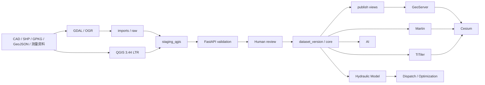

# GIS-OPT-1 QGIS 受控生产链审查报告

- 日期：2026-08-14
- 状态：实现、持久 Compose 部署、发布边界切换与 QGIS GUI 验收已完成
- 审查原则：不以历史 Phase 1D / DGIS Foundation 的通过记录替代 GIS-OPT-1 本轮证据

## 1. 基线

- Branch：`main`
- Start commit：`921a1d99a5e6791a8673baf4adb756b4585911aa`
- End commit：本报告随 GIS-OPT-1 交付提交固化，以交付分支 `git rev-parse HEAD` 为准
- Working tree：提交前包含 GIS-OPT-1 实现；用户已有未跟踪文件 `docs/review/Phase1_GIS_Base_Audit_Report.md` 保持不纳入交付提交

本报告不覆盖或改写 `Phase1_GIS_Base_Audit_Report.md`。

## 2. 实际修改

### 数据库与权限

- `database/migrations/versions/20260814_0011_qgis_governance.py`
- `database/migrations/versions/20260814_0012_publish_geoserver_boundary.py`
- `database/bootstrap_qgis.py`
- `database/bootstrap_app.py`
- `database/seed/demo_data.py`
- `backend/app/gis/models.py`
- `.env.example`
- `docker/docker-compose.yml`

### 治理后端与导入

- `backend/app/gis_governance/`：contracts、state、hashing、repository、validation、service、router、errors
- `backend/app/api/router.py`
- `backend/app/data_converter/gdal_service.py`
- `backend/app/data_converter/importer.py`
- `backend/app/data_converter/router.py`
- 数据版本、河道、横断面、结构物和导入服务的生命周期保护调整

### QGIS

- `qgis/projects/dayu_tiangong_ltr.qgs`
- `qgis/styles/`：四类 staging 和四类 publish QML
- `qgis/docs/pg_service.conf.example`
- `qgis/docs/topology_rules.md`
- `qgis/Start_Dayu_QGIS.cmd`、`qgis/Start_Dayu_QGIS.ps1`
- `qgis/README.md`

### 接口、服务兼容与测试

- OpenAPI 生成脚本与生成客户端
- GeoServer 引导和验证脚本的 `publish` 读取权限检查
- 治理契约、数据库权限、QGIS 静态契约与原有迁移 head 测试

### 文档

- `README.md`、`docs/architecture.md`、`database/database_design.md`
- `docs/adr/ADR-0011-qgis-controlled-production.md`
- `docs/gis/` 下生产流程、治理、角色、CRS 与字段映射
- 本审查报告及外层交付/验证/复盘记录

上述清单以当前工作树为准，最终交付前仍需用 `git diff --name-status` 复核。

## 3. 架构

架构保持单一 `dayu_tiangong` 业务数据库。QGIS 不绕过 validation/review/promotion；Cesium 不承担专业编辑；GeoServer 保持 Basic WFS，不开放 WFS-T。

## 4. 开源复用清单

| 能力 | 采用方案 | 是否自研 |
|---|---|---|
| 桌面 GIS | QGIS 3.44 LTR | 否 |
| 坐标/格式转换 | GDAL/OGR | 否 |
| 空间数据库 | PostGIS | 否 |
| 时态状态 | TimescaleDB | 否 |
| GIS 发布 | GeoServer | 否 |
| MVT | Martin | 否 |
| COG | TiTiler | 否 |
| Web 3D | Cesium | 否 |
| API | FastAPI | 仅业务编排 |
| 数据版本晋级 | 项目领域逻辑 | 是，最小必要 |
| 水利质检 | 复用现有领域语义 + PostGIS | 最小必要扩展 |
| GIS 目录 | GeoNode 可选 profile | 否；不在本阶段核心链路 |

## 5. 数据库

### 新 schema

- `staging_qgis`：四类 QGIS 暂存表；
- `publish`：12 类已发布版本只读兼容视图；
- `imports`、`tiles` 继续复用，不新增第二数据库。

### 新表

- `gis_import_batch`
- `gis_validation_run`
- `gis_validation_issue`
- `gis_review`
- `gis_publication`
- `staging_qgis.river`
- `staging_qgis.cross_section`
- `staging_qgis.gate`
- `staging_qgis.pump`

### `dataset_version` 新字段

`status`、`parent_version_id`、`source_batch_id`、`content_hash`、`change_summary`、`reviewed_by/at`、`approved_by/at`、`published_at`、`retired_at`。

### 新视图

`publish` 下河道、河网节点、河段、横断面、闸门、泵站、注记、行政区、道路、地名、水系名称和 POI 共 12 个兼容视图，只选择状态为 `published` 的版本。GeoServer store 已切换到该 schema。

### 角色与权限

- `dayu_qgis_editor`：LOGIN，读参考/治理/发布，写四张 staging；
- `dayu_qgis_reviewer`：LOGIN，默认只读，查看 staging/issue/core/publish；
- `dayu_publisher`：NOLOGIN，作为受控晋级/发布组角色；
- `dayu_backend`：LOGIN、非 owner，继承 publisher 并承载 backend/worker；
- `dayu_geoserver`：只读 `publish`，已撤销 `public` 核心表读取；
- owner 只用于 migrate/seed/bootstrap 一次性管理任务，不再承载应用运行流量。

### 约束与索引

- 批次、版本、发布的一一对应唯一约束；
- 状态、对象类型、CRS、操作和严重级别 CHECK；
- batch、validation、issue、review、publication 查询索引；
- 四张 staging 的批次来源/业务键唯一约束和 geometry GiST；
- issue geometry GiST。

## 6. QGIS

- Project：`qgis/projects/dayu_tiangong_ltr.qgs`
- Version：QGIS 3.44 LTR
- CRS：CGCS2000 / EPSG:4490
- Groups：`01_REFERENCE_READONLY`、`02_EDIT_STAGING`、`03_PUBLISH_READONLY`
- Editing layers：四类 `staging_qgis.*`
- Review layers：四类 `publish.*`，以及核心/基础参考层
- Forms：字段别名、必填、值域、数值表达式和系统字段只读
- Topology：捕捉/拓扑编辑开启，平台 validation 是最终门禁
- Styles：staging/publish 共八个 QML；QML 与 GeoServer SLD 分别维护
- Credentials：工程仅引用 `service='dayu_qgis'`；密码使用环境、用户级 PostgreSQL service 与 QGIS Auth Manager，不提交到仓库

## 7. API

新增 `/api/v1/gis-governance`：

- `POST|GET /batches`
- `GET /batches/{batch_id}`
- `POST /batches/{batch_id}/stage`
- `POST /batches/{batch_id}/validate`
- `GET /batches/{batch_id}/validation`
- `GET /batches/{batch_id}/issues`
- `POST /batches/{batch_id}/submit-review`
- `POST /batches/{batch_id}/review`
- `GET /batches/{batch_id}/diff`
- `POST /batches/{batch_id}/promote`
- `GET /publications`
- `POST /versions/{version_id}/publish`
- `POST /versions/{version_id}/retire`

GDAL `/api/v1/dgis/conversions/postgis` 保持原入口，但原始表名改为服务器生成的批次不可变名称，并返回 batch/source provenance。mutation 合同保留 actor/reviewer/creator/published_by 字段；由于统一身份尚未接入，只适用于受控开发/验收环境。

## 8. 测试

2026-08-14 在当前工作树实时执行，历史阶段记录未计入下表：

| 范围 | 命令 | 当前结果 |
|---|---|---|
| backend/offline | `$env:PYTHONPATH="backend;."; backend\.venv\Scripts\python.exe -m pytest -q` | `170 passed, 67 skipped` |
| PostGIS/full | 在无持久卷一次性 PostGIS 中设置 `RUN_POSTGIS_TESTS=1` 后执行全量 pytest | `229 passed, 5 skipped`；5 项为缺少 QGIS CLI 等可选外部能力 |
| lifecycle/atomic/permissions | 治理 PostGIS、完整性与 QGIS 权限三个专项文件 | `22 passed` |
| QGIS static/CLI | `tests/test_qgis_project_contract.py`，指定 QGIS 3.44.13 `qgis_process` | `11 passed`，无跳过 |
| QGIS native load | QGIS 3.44 Python API 读取最终 `.qgs` 并连接持久 PostGIS | 14/14 图层有效，3/3 关系有效，EPSG:4490 |
| persistent permissions | QGIS 与应用账号真实 PostGIS 专项 | `7 passed` + `3 passed` |
| GeoServer live | `backend\.venv\Scripts\python.exe geoserver\verify.py` | 12 层、WMS/WMTS、Basic WFS、只读角色与 FastAPI 通过 |
| OpenAPI | 从当前 FastAPI OpenAPI 执行 `npm.cmd run openapi:update` | 通过；generated client 已同步 |
| frontend | `npm.cmd run typecheck`；`npm.cmd run build` | 均通过；仅既有大 chunk 警告 |
| Compose | `docker compose --env-file .env -p dayu-tiangong-phase1 -f docker/docker-compose.yml config --quiet` | 通过 |
| quality | `compileall`；`git diff --check`；全量 QGIS secret/path scan | 通过；仅 Git 的 LF/CRLF 提示 |

历史 Phase 1D 的 `124 passed` 和 DGIS Foundation 的在线证据只作为回归基准，不能替代上述命令。

## 9. Runtime

Docker Engine 29.6.2 可用。本轮先创建了一个**无持久卷、仅绑定 127.0.0.1:55432、停止即删除**的一次性 PostGIS/TimescaleDB 容器，并完成：

- 从空库迁移到 `20260814_0012`；
- DEMO seed 连续执行两次，计数稳定为 1 个版本、3 河道、20 断面、5 闸门、3 泵站等；
- `qgis-bootstrap` 连续执行两次，证明角色初始化幂等；
- editor/reviewer/publisher/GeoServer 权限、完整治理链、校验后篡改门禁、100 条第 73 条故障原子回滚与重复晋级幂等通过；
- `0012 → 0011 → 0012 → seed` 通过；最终 head=`20260814_0012`；
- 一次性容器已停止并自动删除，没有复用或修改现有 `dayu_postgres_data`。

获得用户明确授权后，执行前先生成持久库备份 `06_验证记录/backups/2026-08-14_GIS-OPT-1-before-0011/dayu_tiangong_before_0011.dump`（SHA-256 `683acc9649c9a516de36eb49ea4baca11d7b1c6bbf7e55dc385280ab620d1e46`），随后把现有库从 0010 迁移到 0012，运行 seed、qgis-bootstrap、app-bootstrap 和 geoserver-init。backend/worker 已以 `dayu_backend` 非 owner 账号运行；GeoServer store 已切换至 `publish`，12 层在线回归通过。数据库、Redis、GeoServer、Martin、TiTiler、backend、worker 均为 healthy，frontend 正常运行，一次性任务均退出码 0。

QGIS 3.44.13 已安装在项目工作目录。因 QGIS/Qt 在中文安装路径下会破坏 Python 搜索路径，仓库提供短英文盘符启动器；最终工程已由原生 QGIS API 验证 14/14 图层和 3/3 关系有效，并实际打开为 `dayu_tiangong_ltr — QGIS`，进程保持响应，未再出现 SIP 错误或 `readSymbology` 崩溃。

## 10. 未完成事项

- 平台统一 OIDC/IAM、端点 RBAC 与强身份绑定未完成；
- GeoNode 仍是可选 profile，不是本阶段必要链路；
- 已实现 `published → retired` 退役审计端点；历史版本重新发布/一键回滚闭环、对象存储、HA、灾备和保留策略未完成；
- 堤防/护岸、水库/调蓄区、洪水淹没 Polygon、横断面线/左右岸/垂直基准、监测站和通用水工建筑物未进入本阶段；
- 数据仍为 DEMO，模型未经真实工程率定，未接实时监测和 PLC/SCADA，不具备自动控制权限。

## 11. 下一阶段建议

进入 **GIS-OPT-2：水利专业对象补齐 + 发布闭环**，优先：

1. 堤防 / 护岸；
2. 水库 / 调蓄区；
3. 洪水淹没 Polygon；
4. 横断面线、左右岸和高程基准；
5. 监测站；
6. 通用水工建筑物；
7. 补齐统一 IAM/RBAC、真实率定数据门禁和生产高可用部署方案。

启动 GIS-OPT-2 前，应由业务方提供身份系统参数、真实观测/率定资料和目标生产拓扑；PLC/SCADA 接入必须另行完成安全评审，默认不开放设备控制。
