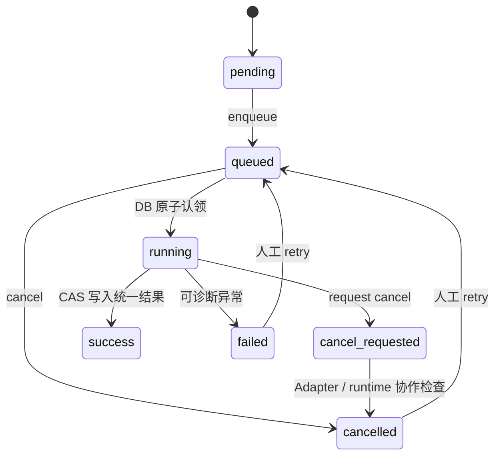

# Hydraulic 1D Worker 与任务生命周期

## 状态机

API 只创建、冻结、入队、查询、取消和人工重试；`hydraulic-1d` Worker 负责认领、从冻结的 `Hydraulic1DModel` 准备独立工作目录、运行 MASCARET Adapter、解析结果和持久化。认领使用数据库行锁与 execution token，同一任务不能被两次成功提交。

取消为协作式：`queued` 直接取消；`running` 先写 `cancel_requested`，Adapter 在外部进程轮询中终止对应 job。超时、非零退出、缺失/损坏 `.opt` 或结果非有限数均为终态可诊断错误。输入/能力错误和缺失运行时不得无限自动重试。

每个 simulation/job 必须使用 `HYDRAULIC_WORKSPACE_ROOT` 下的唯一目录。清理仅允许在已验证的工作根内进行，禁止共享 case 目录。生产同步 `/run` 路径保持禁用。

Compose 中通用 Worker 与 `hydraulic-worker` 分离，后者只监听 `hydraulic-1d` 队列。镜像默认 `MASCARET_ENABLED=0`；启用前必须由部署方提供官方 v9.1.1 CLI。
