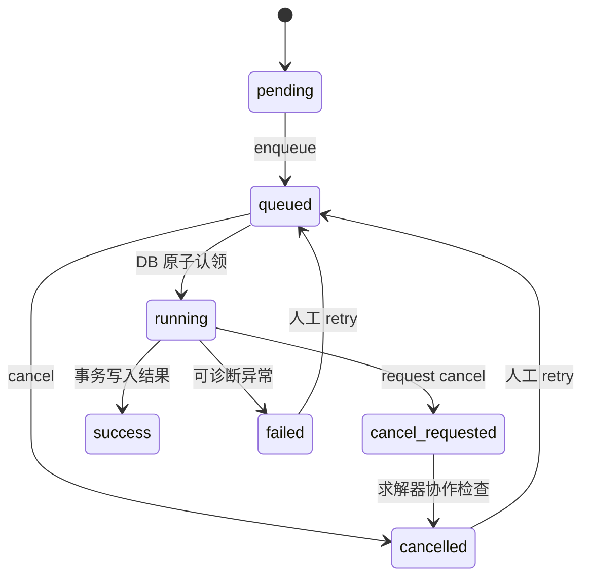

# Phase 4 Worker 与任务生命周期

## 状态机

API 只创建/冻结/入队/查询/取消；Worker 负责认领、执行、持久化和心跳。认领在数据库行锁中完成，同一任务不能成功认领两次。Worker ID、队列 job ID、排队/开始/结束/心跳时间、当前模拟时间/CFL、重试次数/原因均可审计。

取消为协作式：queued 直接取消；running 写 `cancel_requested`，引擎在同步输出/数值步检查。超时 running 可按 heartbeat 标记失败并由人工重试；数值输入错误不会无限自动重试。同步 `/run` 标为 deprecated，生产默认禁用。

Compose 使用 Redis 7.4、Celery 5.5.3 和 solo worker。本次重建后 database/redis/backend/worker 均 healthy，migrate/seed 为 exit 0。
